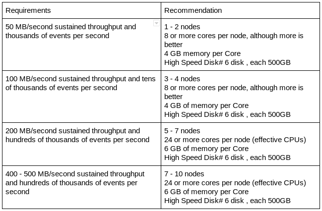

# Deployment Best Practices

## Configuration Best Practices for Production
  
    - Increase the number of TCP socket ports available
    
      This is particularly important if the flow will be setting up and tearing down a large number of sockets in small period of time.
        
           sudo sysctl -w net.ipv4.ip_local_port_range="10000 65000"
       
    - Tell Linux you never want NiFi to swap
       Swapping is fantastic for some applications. It isn’t good for something like NiFi that always wants to be running. 
       To tell Linux you’d like swapping off you can edit '/etc/sysctl.conf' to add the following line
           
           vm.swappiness = 0
           
        For the partitions handling the various NiFi repos turn off things like 'atime'. Doing so can cause a surprising bump in 
        throughput. Edit the '/etc/fstab' file and for the partition(s) of interest add the 'noatime' option.
        
## Hardware Sizing Recommendations

Following is the recommnded hardware for Nifi Production installation:

