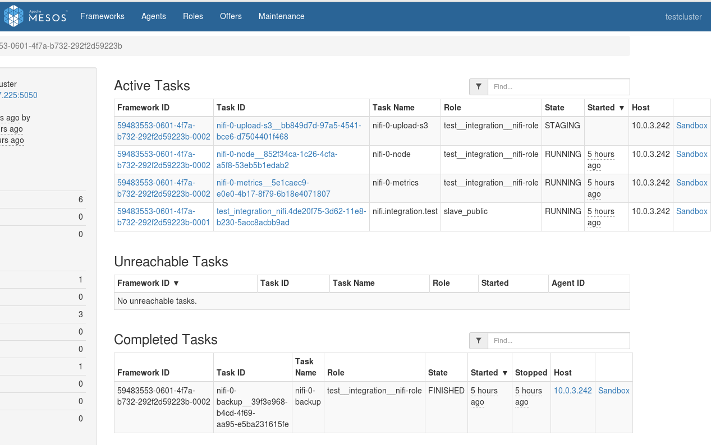
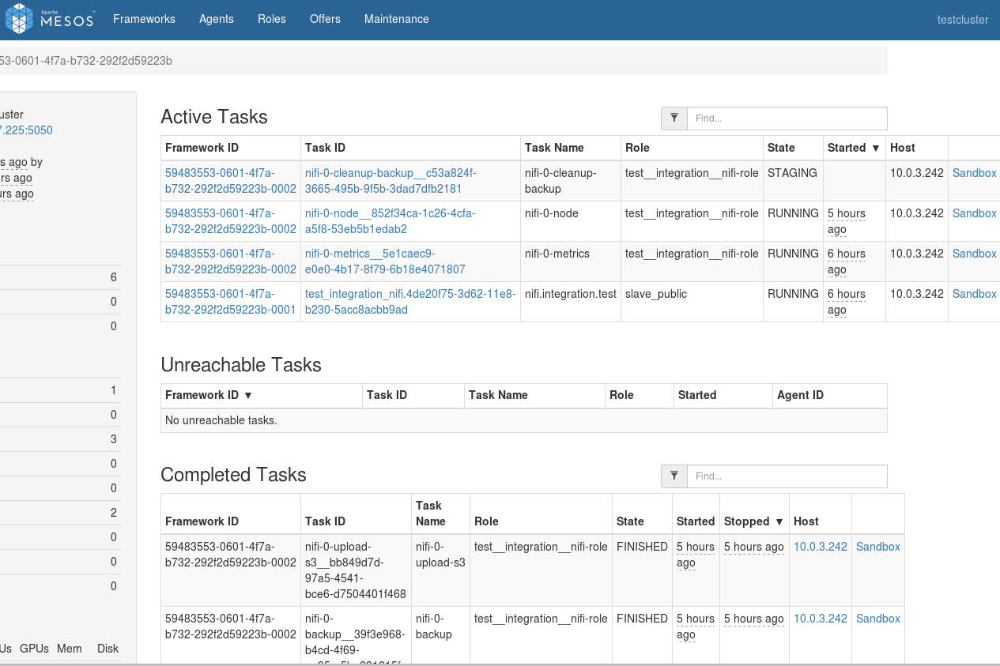

# Updating Configuration

You can make changes to the service after it has been launched. Configuration management is handled by the scheduler process, which in turn handles Nifi deployment itself.

After making a change, the scheduler will be restarted, and it will automatically deploy any detected changes to the service, one node at a time. For example, a given change will first be applied to `nifi-0`, then `nifi-1`, and so on.

Nodes are configured with a "Readiness check" to ensure that the underlying service appears to be in a healthy state before continuing with applying a given change to the next node in the sequence.

Some changes, such as decreasing the number of nodes or changing volume requirements, are not supported after initial deployment. See [Limitations](#limitations).


The instructions below describe how to update the configuration for a running DC/OS service.

### Enterprise DC/OS 1.10

Enterprise DC/OS 1.10 introduces a convenient command line option that allows for easier updates to a service's configuration, as well as allowing users to inspect the status of an update, to pause and resume updates, and to restart or complete steps if necessary.

#### Prerequisites

+ Enterprise DC/OS 1.10 or newer.
+ Service with 1.5.0 version.
+ [The DC/OS CLI](https://docs.mesosphere.com/latest/cli/install/) installed and available.
+ The service's subcommand available and installed on your local machine.
  + You can install just the subcommand CLI by running `dcos package install --cli --yes nifi`.
  + If you are running an older version of the subcommand CLI that doesn't have the `update` command, uninstall and reinstall your CLI.
    ```shell
    dcos package uninstall --cli nifi
    dcos package install --cli nifi
    ```

#### Preparing configuration

If you installed this service with Enterprise DC/OS 1.10, you can fetch the full configuration of a service (including any default values that were applied during installation). For example:

```shell
dcos nifi describe > options.json
```

Make any configuration changes to the `options.json` file.

If you installed this service with a prior version of DC/OS, this configuration will not have been persisted by the the DC/OS package manager. You can instead use the `options.json` file that was used when [installing the service](https://github.com/mesosphere/dcos-nifi/blob/ServiceGuide/docs/install.md).

<strong>Note:</strong> You need to specify all configuration values in the `options.json` file when performing a configuration update. Any unspecified values will be reverted to the default values specified by the DC/OS service. See the "Recreating `options.json`" section below for information on recovering these values.

##### Recreating `options.json` (optional)

If the `options.json` from when the service was last installed or updated is not available, you will need to manually recreate it using the following steps.

First, we'll fetch the default application's environment, current application's environment, and the actual nifi that maps config values to the environment:

1. Ensure you have [jq](https://stedolan.github.io/jq/) installed.
2. Set the service name that you're using, for example:
	```shell
	SERVICE_NAME=nifi
	```
3. Get the version of the package that is currently installed:
	```shell
	PACKAGE_VERSION=$(dcos package list | grep $SERVICE_NAME | awk '{print $2}')
	```
4. Then fetch and save the environment variables that have been set for the service:
	```shell
	dcos marathon app show $SERVICE_NAME | jq .env > current_env.json
	```
5. To identify those values that are custom, we'll get the default environment variables for this version of the service:
	```shell
	dcos package describe --package-version=$PACKAGE_VERSION --render --app $SERVICE_NAME | jq .env > default_env.json
	```
6. We'll also get the entire application nifi:
	```shell
	dcos package describe $SERVICE_NAME --app > marathon.json.mustache
	```

Now that you have these files, we'll attempt to recreate the `options.json`.

1. Use JQ and `diff` to compare the two:
	```shell
	diff <(jq -S . default_env.json) <(jq -S . current_env.json)
	```
2. Now compare these values to the values contained in the `env` section in application nifi:
	```shell
	less marathon.json.mustache
	```
3. Use the variable names (e.g. `{{service.name}}`) to create a new `options.json` file as described in [Initial service configuration](#initial-service-configuration).

#### Starting the update

Once you are ready to begin, initiate an update using the DC/OS CLI, passing in the updated `options.json` file:

```shell
dcos nifi update start --options=options.json
```

You will receive an acknowledgement message and the DC/OS package manager will restart the Scheduler in Marathon.

See [Advanced update actions](#advanced-update-actions) for commands you can use to inspect and manipulate an update after it has started.

To see a full listing of available options, run `dcos package describe --config nifi` in the CLI, or browse the DC/OS nifi Service install dialog in the DC/OS Dashboard.

<a name="adding-a-node"></a>
### Adding a Node

The service deploys 2 nodes by default. You can customize this value at initial deployment or after the cluster is already running. Shrinking the cluster is not supported.

Modify the COUNT `"node":{"count":3}` environment variable to update the node count. If you decrease this value, the scheduler will prevent the configuration change until it is reverted back to its original value or larger.

<a name="resizing-a-node"></a>
### Resizing a Node

The CPU and Memory requirements of each node can be increased or decreased as follows:
- CPU: ` "node": {"cpus": <CPU Value>}`
- Memory (in MB): `"node": {"mem": 4096}` 

**Note:** Volume requirements (type and/or size) cannot be changed after initial deployment.

<a name="updating-placement-constraints"></a>
### Updating Placement Constraints

Placement constraints may be updated after initial deployment using the following procedure. See [Service Settings](#service-settings) above for more information on placement constraints.

Let's say we have the following deployment of our nodes

- Placement constraint of: `hostname:LIKE:10.0.10.3|10.0.10.8|10.0.10.26|10.0.10.28|10.0.10.84`
- Tasks:

```shell
10.0.10.3: nifi-0
10.0.10.8: nifi-1
10.0.10.26: nifi-2
10.0.10.28: empty
10.0.10.84: empty
```


`10.0.10.8` is being decommissioned and we should move away from it. Steps:

    1. Remove the decommissioned IP and add a new IP to the placement rule whitelist by editing `placement_constraint`:

	
```shell
	hostname:LIKE:10.0.10.3|10.0.10.26|10.0.10.28|10.0.10.84|10.0.10.123
```	
    2. Redeploy `_NODEPOD_-1` from the decommissioned node to somewhere within the new whitelist: `dcos nifi pod replace _NODEPOD_-1`
    3. Wait for `_NODEPOD_-1` to be up and healthy before continuing with any other replacement operations.
    
The placement constraints can be modified by configuring the "placement constraint" section of the Config.json file:

	
```shell
	"placement_constraint": {
          "type": "string",
          "title": "Placement Constraint",
          "description": "Marathon-style placement constraint for nodes. Example: [[\"hostname\", \"UNIQUE\"]]",
          "default": "[[\"hostname\", \"UNIQUE\"]]",
          "media": {
            "type": "application/x-zone-constraints+json"
        }
```

<a name="restarting-a-node"></a>
## Restarting a Node

This operation will restart a node, while keeping it at its current location and with its current persistent volume data. This may be thought of as similar to restarting a system process, but it also deletes any data that is not on a persistent volume.

1. Run `dcos nifi pod restart nifi-<NUM>`, e.g. `nifi_-2`.

<a name="replacing-a-node"></a>
## Replacing a Node

This operation will move a node to a new agent and will discard the persistent volumes at the prior system to be rebuilt at the new system. Perform this operation if a given system is about to be offlined or has already been offlined.

**Note:** Nodes are not moved automatically. You must perform the following steps manually to move nodes to new systems. You can automate node replacement according to your own preferences.

1. Run `dcos nifi pod replace nifi-<NUM>`, e.g. `nifi_-2` to halt the current instance with id `<NUM>` (if still running) and launch a new instance on a different agent.

For example, let's say `nifi-2`'s host system has died and `nifi-2` needs to be moved.

1. NOW THAT THE NODE HAS BEEN DECOMMISSIONED, (IF NEEDED BY YOUR SERVICE) start `nifi-2` at a new location in the cluster.
    ```shell
    dcos nifi pod replace nifi-2
    ```

## Advanced update actions

The following sections describe advanced commands that be used to interact with an update in progress.

### Monitoring the update

Once the Scheduler has been restarted, it will begin a new deployment plan as individual pods are restarted with the new configuration. 

You can query the status of the update as follows:

```shell
dcos nifi update status
```

If the Scheduler is still restarting, DC/OS will not be able to route to it and this command will return an error message. Wait a short while and try again. You can also go to the Services tab of the DC/OS GUI to check the status of the restart.

### Pause

To pause an ongoing update, issue a pause command:

```shell
dcos nifi update pause
```

You will receive an error message if the plan has already completed or has been paused. Once completed, the plan will enter the `WAITING` state.

### Resume

If a plan is in a `WAITING` state, as a result of being paused or reaching a breakpoint that requires manual operator verification, you can use the `resume` command to continue the plan:

```shell
dcos nifi update resume
```

You will receive an error message if you attempt to `resume` a plan that is already in progress or has already completed.

### Force Complete

In order to manually "complete" a step (such that the Scheduler stops attempting to launch a task), you can issue a `force-complete` command. This will instruct to Scheduler to mark a specific step within a phase as complete. You need to specify both the phase and the step, for example:

```shell
dcos nifi update force-complete service-phase service-0:[node]
```

### Force Restart

Similar to force complete, you can also force a restart. This can either be done for an entire plan, a phase, or just for a specific step.

To restart the entire plan:
```shell
dcos nifi update force-restart
```

Or for all steps in a single phase:
```shell
dcos nifi update force-restart service-phase
```

Or for a specific step within a specific phase:
```shell
dcos nifi update force-restart service-phase service-0:[node]
```
## Taking Backup

The DCOS Nifi Framework allows backup of Nifi Application to Amazon S3. The following information / values are required for Backup.

    1. AWS_ACCESS_KEY_ID
    2. AWS_SECRET_ACCESS_KEY
    3. AWS_REGION
    4. S3_BUCKET_NAME

To enable backup, we have to trigger the backup-S3 Plan with the following plan parameters: 
```shell
{
 'AWS_ACCESS_KEY_ID': key_id,
 'AWS_SECRET_ACCESS_KEY': aws_secret_access_key,
 'AWS_REGION': 'us-east-1',
 'S3_BUCKET_NAME': bucket_name
}
```
This plan can be executed with the following command:
```shell
{
 dcos nifi --name=<service_name> plan start <plan_name> -p <plan_parameters>
}
```
or with a command, including plan parameters itself:
```shell
{
 dcos nifi --name=<SERVICE_NAME> plan start backup-s3 \
  -p AWS_ACCESS_KEY_ID=<ACCESS_KEY> \
  -p AWS_SECRET_ACCESS_KEY=<SECRET_ACCESS_KEY> \
  -p AWS_REGION=<REGION> \
  -p S3_BUCKET_NAME=<BUCKET_NAME>
}
````

However, the backup can also be started with the following command:


Once this plan execution is completed, the backup will be uploaded to S3. 
The Nifi backup is taken using the Nifi toolkit. The Nifi backup will be done using three sidecar tasks:

    1. Backup - Backup to local node (ROOT/MOUNT)
       
       The Backup task is responsible for taking backup of the local application and backing it up to the local node, which may be on the ROOT or Mount Volumne.

   [](../service/Backup.png)

       
    2. Upload_to_S3 - Upload the backup from the local node to S3
    
       This sidecar task takes the backup created in Step 1, from the ROOT/Mount volume, and uploads it to Amazon S3 in the Bucket Name specified.
       
   [](../service/S3Upload.png)       
       
    3. Cleanup - Remove the backup from local node.
    
       Once, Step 2 is complete and the Backup has been uploaded to S3, a Sidecar Task known as Cleanup is triggered. This task cleans up/ removes the backup folder from the local Root/Mount volumes.
   [](../service/Cleanup.png)


## Nifi Toolkit Commands


The admin toolkit contains command line utilities for administrators to support NiFi maintenance in standalone and clustered environments. These utilities include:

    Notify — The notification tool allows administrators to send bulletins to the NiFi UI using the command line.

    Node Manager — The node manager tool allows administrators to perform a status check on a node as well as to connect, disconnect, or remove nodes that are part of a cluster.

    File Manager — The file manager tool allows administrators to backup, install or restore a NiFi installation from backup.

The admin toolkit is bundled with the nifi-toolkit and can be executed with scripts found in the bin folder. Further docmentation is available at [Nifi Administration Toolkit](https://nifi.apache.org/docs/nifi-docs/html/administration-guide.html#admin-toolkit). 

To execute the Nifi Administration Toolkit commands, we need to do a dcos task exec to a Nifi node, set the JAVA_HOME using the command:
```shell
export JAVA_HOME=$(ls -d $MESOS_SANDBOX/jdk*/jre*/) && export JAVA_HOME=${JAVA_HOME%/} && export PATH=$(ls -d $JAVA_HOME/bin):$PATH
````
and then run the node manager commands from $MESOS_SANDBOX/nifi-toolkit-1.5.0/bin directory:
```shell


To connect, disconnect, or remove a node from a cluster:

node-manager.sh -d <NIFI_HOME> –b <nifi bootstrap file path>
-o {remove|disconnect|connect|status} [-u {url list}] [-p {proxy name}] [-v]

To show help:

node-manager.sh -h

The following are available options:

    -b,--bootstrapConf <arg> Existing Bootstrap Configuration file (required)

    -d,--nifiInstallDir <arg> NiFi Root Folder (required)

    -h,--help Help Text (optional)

    -o, --operation <arg> Operations supported: status, connect (cluster), disconnect (cluster), remove (cluster)

    -p,--proxyDN <arg> Proxy or User DN (required for secured nodes doing connect, disconnect and remove operations)

    -u,--clusterUrls <arg> Comma delimited list of active urls for cluster (optional). Not required for disconnecting a node yet will be needed when connecting or removing from a cluster

    -v,--verbose Verbose messaging (optional)

````

### Example

**To check for dcos tasks**

```shell
>> dcos task

NAME            HOST         USER   STATE  ID                                                    MESOS ID                                 
nifi            10.0.0.196   root     R    nifi.9b11498f-415f-11e8-81a4-e25c6192ea05             1d166af3-8666-4f3e-8add-dcaad139c900-S3  
nifi-0-metrics  10.0.0.199  nobody    R    nifi-0-metrics__958e2af9-c7d0-4cb9-b1fc-08c810b05254  1d166af3-8666-4f3e-8add-dcaad139c900-S1  
nifi-0-node     10.0.0.199  nobody    R    nifi-0-node__68c0d8a0-4c36-4a86-a287-5dc67ce19fde     1d166af3-8666-4f3e-8add-dcaad139c900-S1  
nifi-1-metrics  10.0.0.58   nobody    R    nifi-1-metrics__e58b8f2d-e19f-48f7-b154-6d11e65c54a9  1d166af3-8666-4f3e-8add-dcaad139c900-S5  
nifi-1-node     10.0.0.58   nobody    R    nifi-1-node__1a3d71c6-3c23-4a96-bba3-859de2c0615d     1d166af3-8666-4f3e-8add-dcaad139c900-S5
````
**To enter into a dcos node**

```shell
dcos task exec -ti nifi-0-node__68c0d8a0-4c36-4a86-a287-5dc67ce19fde bash
````

**To set Java Path**

```shell
export JAVA_HOME=$(ls -d $MESOS_SANDBOX/jdk*/jre*/) && export JAVA_HOME=${JAVA_HOME%/} && export PATH=$(ls -d $JAVA_HOME/bin):$PATH
````
**Tip:** To check for Java Home, run the following command:
```shell
echo $JAVA_HOME
````
This would return the Java home Path:

/var/lib/mesos/slave/slaves/1d166af3-8666-4f3e-8add-dcaad139c900-S1/frameworks/1d166af3-8666-4f3e-8add-dcaad139c900-0003/executors/nifi__78b829b7-3963-4083-b33b-4147fcab559f/runs/fb826e37-17e6-4349-b7c4-63060b51ff0a/containers/8bd354e5-a2a6-4185-9454-647b98b9b327/jdk1.8.0_162/jre

**Example of Backup Command through Toolkit**
```shell
 sh $MESOS_SANDBOX/nifi-toolkit-${NIFI_VERSION}/bin/file-manager.sh -o backup -b nifi-backup -c $MESOS_SANDBOX/../../tasks/nifi-$POD_INSTANCE_INDEX-node*/nifi-{{NIFI_VERSION}} -v;
````

