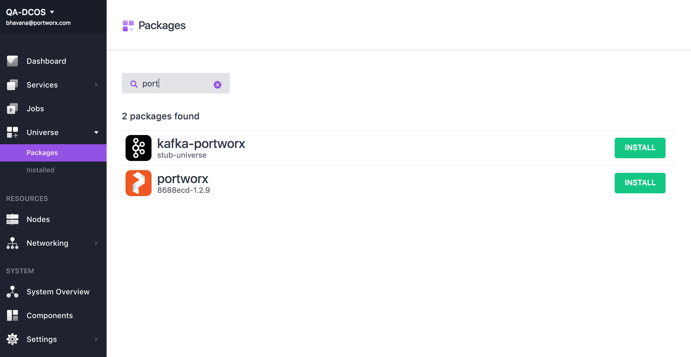
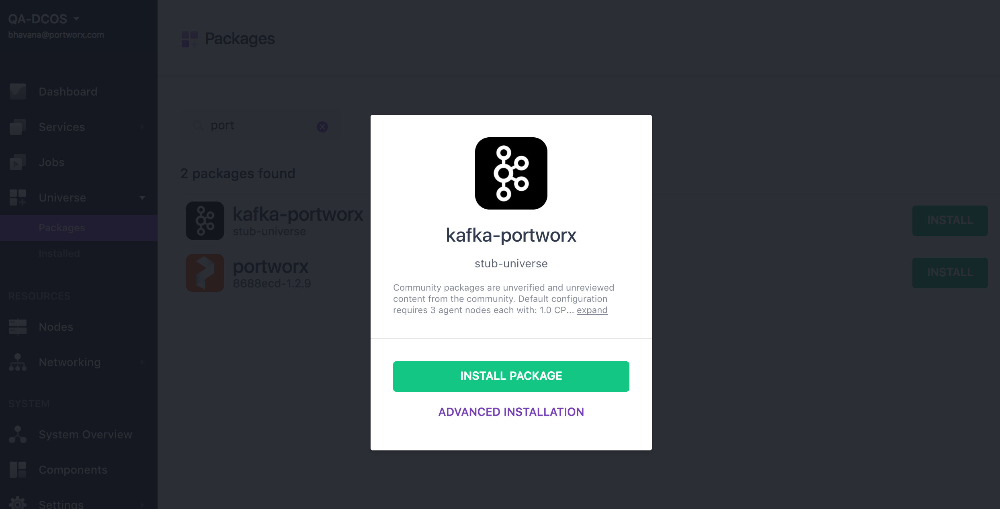
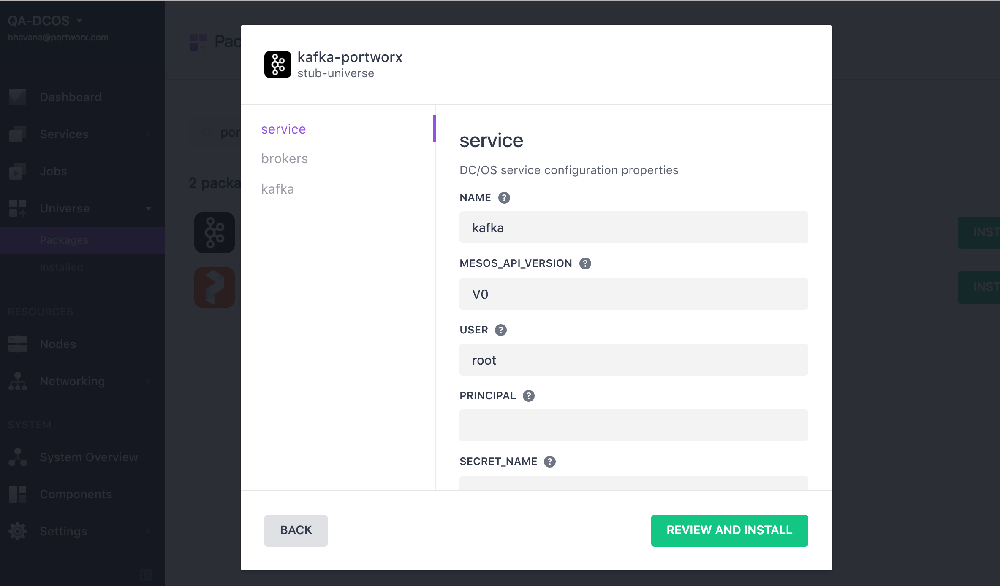
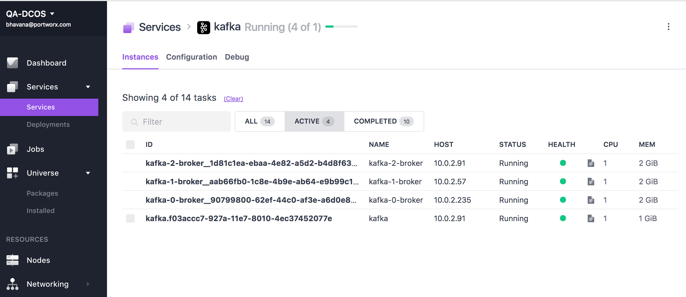
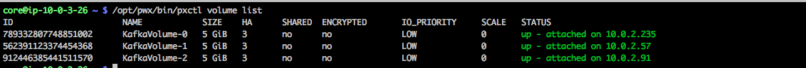

The following instruction will install Kafka service on DC/OS cluster backed by Portworx volumes for persistent storage.

# Prerequisites

- A DC/OS v1.9 cluster with Portworx installed on at least 3 private agents
- Portworx works best when installed on all nodes in a DC/OS cluster. If Portworx is to be installed on a subset of the cluster, then constraints must be used to specify the nodes where Portworx is installed.
- A node in the cluster with a working DC/OS CLI.

Please review the main [Portworx on DCOS](https://docs.portworx.com/scheduler/mesosphere-dcos/) documentation.
# Install Kafka

portworx-kafka package should be available under Universe->Packages

## Default Install
If you want to use the defaults, you can now run the dcos command to install the service
```
 $ dcos package install --yes portworx-kafka
```
You can also click on the  “Install” button on the WebUI next to the service and then click “Install Package”.
This will install all the prerequisites and start the Kafka service on 3 private agents.

## Advanced Install
If you want to modify the defaults, click on the “Install” button next to the package on the DC/OS UI and then click on
“Advanced Installation”

This provides an option to change the service name, volume name, volume size, and provide any additional options that needs to be passed to portworx volume.
Kafka related parameters can also be modified, for example: number of broker nodes.


Click on “Review and Install” and then “Install” to start the installation of the service.
## Install Status
Click on the Services page to monitor the status of the installation.

Kafka service is ready to use when the schedulre service and all the Kafka-service are in running state.

Checking the Portworx's cluster will list multiple volumes that were automatically created using the options provided during install.
There will be one volume for each Broker.


# Verifying Instalation
Install Kafka CLI using the following command on DC/OS client
```
  $ dcos package install portworx-kafka --cli
```
Find out kafka endpoints
```
dcos portworx-kafka --name kafka endpoints broker
{
      "address": [
              "10.0.2.235:1025",
              "10.0.2.57:1025",
              "10.0.2.91:1025"
                 ],
       "dns": [
              "kafka-0-broker.kafka.autoip.dcos.thisdcos.directory:1025",
              "kafka-1-broker.kafka.autoip.dcos.thisdcos.directory:1025",
              "kafka-2-broker.kafka.autoip.dcos.thisdcos.directory:1025"
                ],
        "vip": "broker.kafka.l4lb.thisdcos.directory:9092"
}
```
```
$ dcos portworx-kafka --name kafka endpoints zookeeper
master.mesos:2181/dcos-service-kafka
```
# Further resources

For more detailed description on using Portworx through DCOS please visit  [Portworx on DCOS framework homepage](https://docs.portworx.com/scheduler/mesosphere-dcos)
