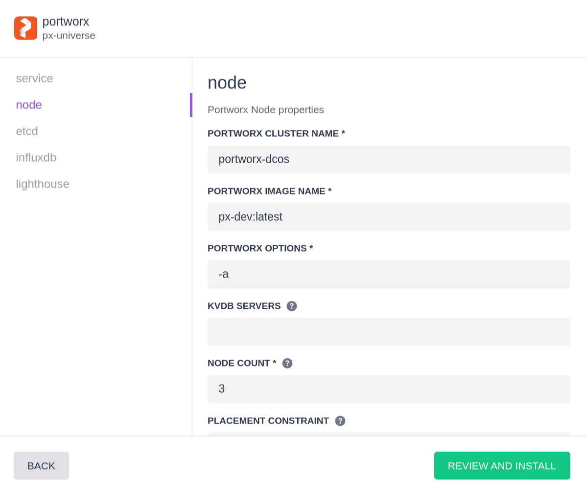
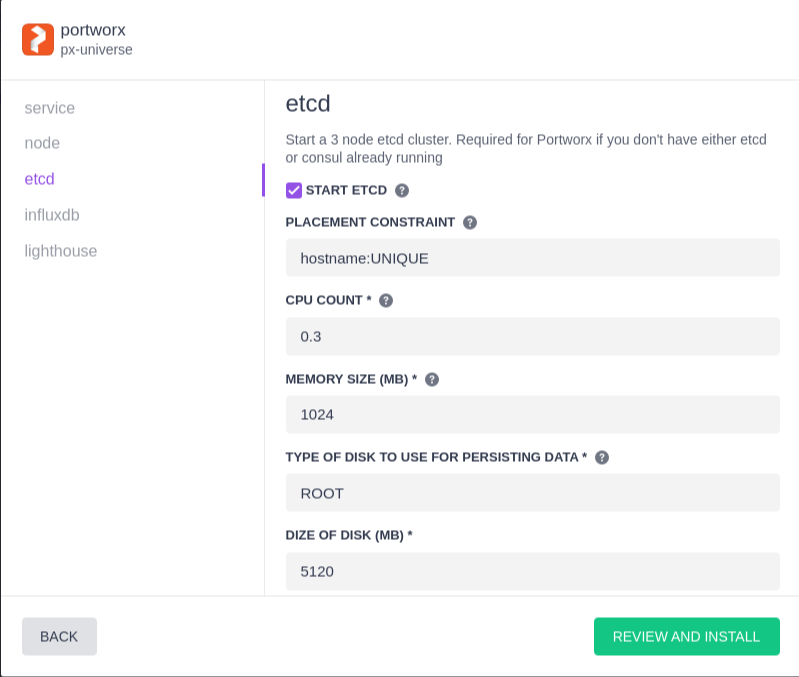
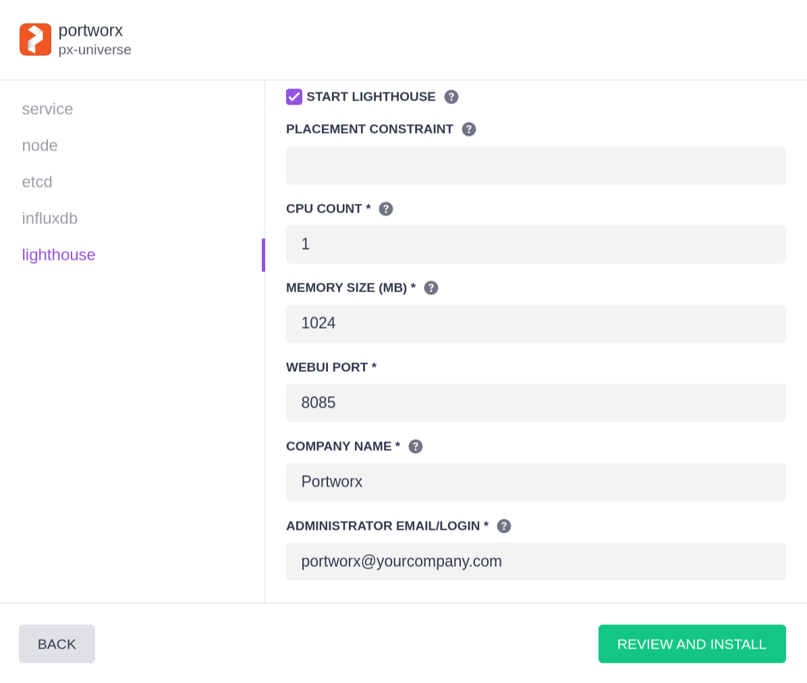
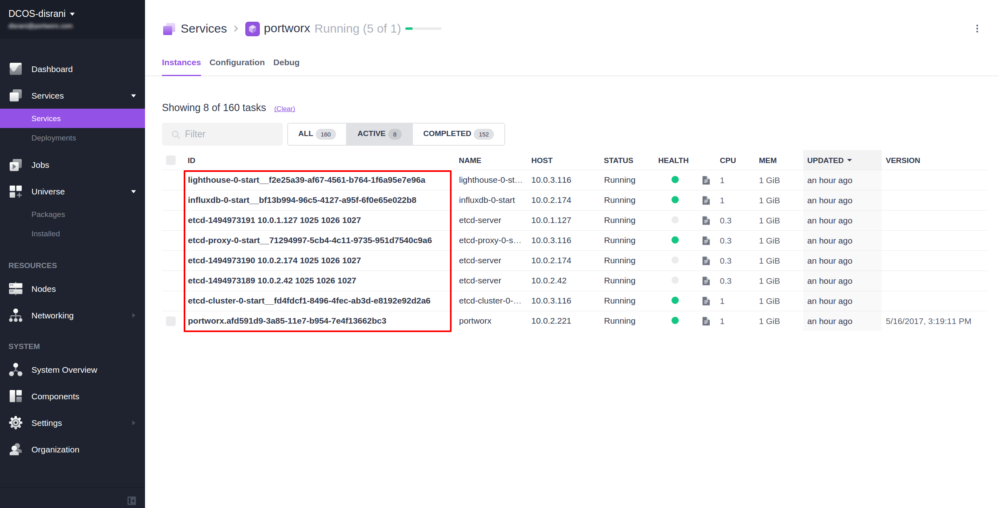
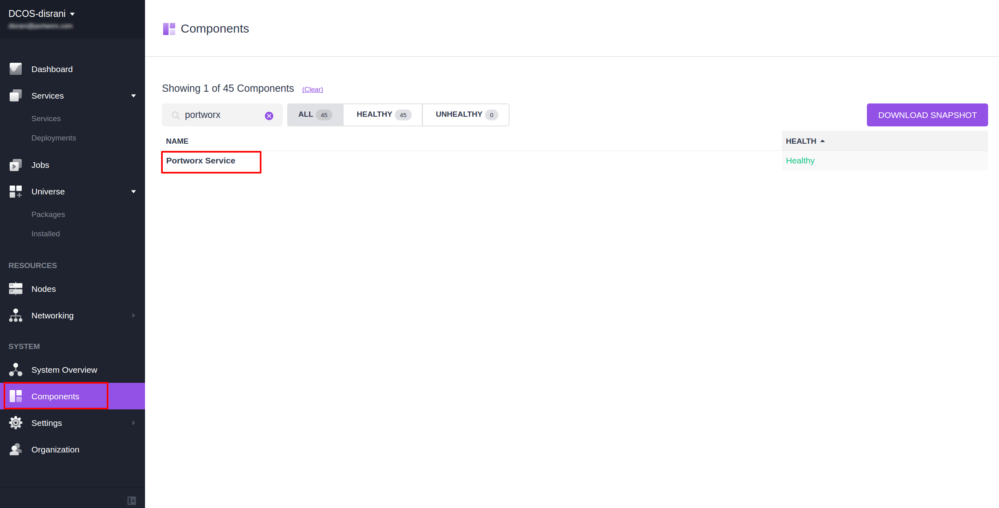
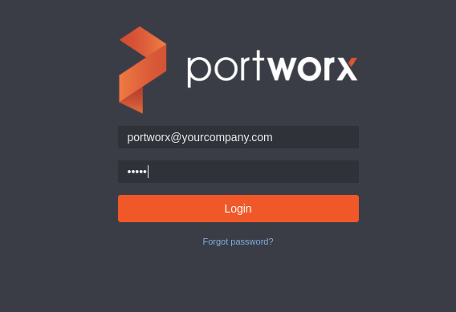
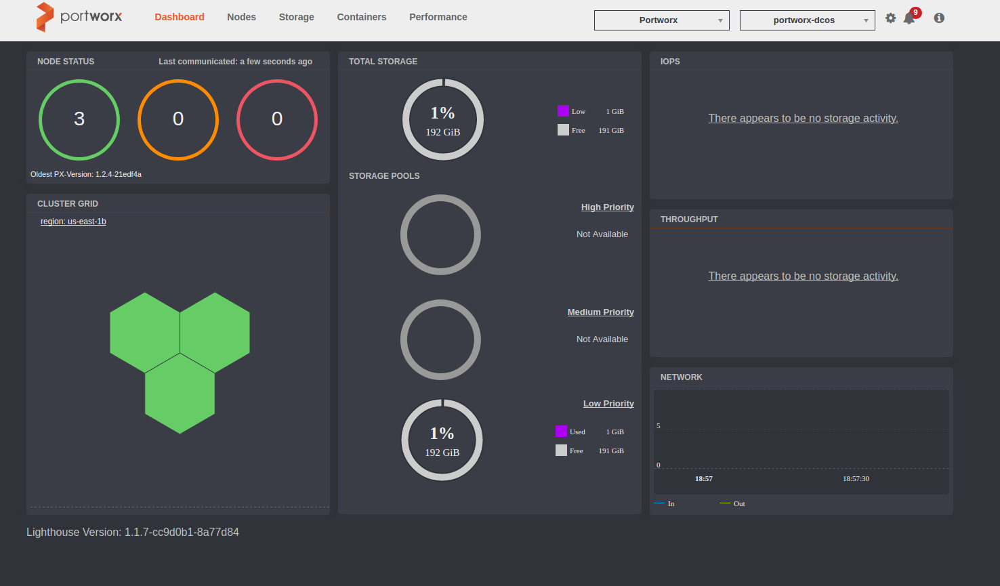
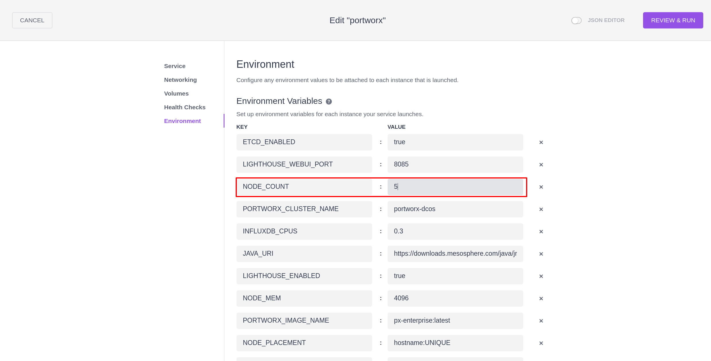

 

Portworx provides scale-out storage for containers. Portworx storage is delivered as a container that is installed on your servers. Portworx technology:

* Provides data protection and container-granular management.
* Enables companies to run multi-cloud with any scheduler.
* Manages storage that is directly attached to servers, from cloud volumes, or provided by hardware arrays.
* Is radically simple.

Portworx technology is available as PX-Developer and PX-Enterprise.

- Estimated time for completion: 45 minutes
- Target audience: Anyone who wants to deploy a persistent elastic data services solution on DC/OS. 
- This package requires an intermediate/advanced DC/OS skill set.

Please review the main [Portworx on DCOS](https://docs.portworx.com/scheduler/mesosphere-dcos/) documentation.

# Prerequisites

- A running DC/OS v1.9 cluster with at least 3 private agents. Portworx-on-DCOS REQUIRES at least 3 nodes for installation.
- All nodes in the cluster that will participate in a Portworx cluster MUST have a separate non-root volume to use.  
- A node in the cluster with a working DC/OS CLI.

# Portworx Agent-Node configuration

- Portworx can run on DCOS agent nodes that are either on-prem or in the cloud.
- Portworx works best when installed on all nodes in a DC/OS cluster.  If Portworx is to be installed on a subset of the cluster, then:
 * the agent-nodes must include attributes indicating the participate in the Portworx cluster.
 * services that depend on Portworx volumes must specify "constraints" to ensure they are launched on nodes that can access Portworx volumes.

# Install Portworx
## Default Install
If you want to use the defaults, you can now run the dcos command to install the service
```
$ dcos package install --yes portworx
```
You can also click on the  “Install” button on the WebUI next to the service and then click “Install Package”.

This will install all the prerequisites and start the Portworx service on 3 private agents.
The default login/password for lighthouse would be portworx@yourcompany.com/admin

## Advanced Install
If you want to modify the defaults, click on the “Install” button next to the package on the DCOS UI and then click on
“Advanced Installation”

Through the advanced install options you can change the configuration of the Portworx deployment. Here you can choose to
disable etcd (if you have an external etcd service) as well as disable the Lighthouse service in case you do not want to
use the WebUI.

## Portworx Options
Specify your kvdb (consul or etcd) server if you don't want to use the etcd cluster with this service. If the etcd cluster
is enabled this config value will be ignored.
If you have been given access to the Enterprise version of PX you can replace px-dev:latest with px-enterprise:latest.
With PX Enterprise you can increase the number of nodes in the PX Cluster to a value greater than 3.



## Etcd Options
By default a 3 node etcd cluster will be created with 5GB of local persistent storage. The size of the persistent disks can
be changed during install. This can not be updated once the service has been started so please make sure you have enough
storage resources available in your DCOS cluster before starting the install.



## Lighthouse options
By default the Lighthouse service will be installed. If this is disabled the influxdb service will also be disabled.

You can enter the admin email to be used for creating the Lighthouse account. This can be used to login to Lighthouse
after install is complete. The default password is `admin` which can be changed after login.



Once you have configured the service, click on “Review and Install” and then “Install” to start the installation of the
service.

# Install Status

Once you have started the install you can go to the Services page to monitor the status of the installation.

If you click on the Portworx service you should be able to look at the status of the services being created. 

In a default install there will be one service for the framework scheduler, 4 services for etcd (
3 etcd nodes and one etcd proxy), one service for influxdb and one service for lighthouse.



The install for Portworx on the agent nodes will also run as a service but they will "Finish" once the installation is done.

You can check the nodes where Portworx is installed and the status of the Portworx service by clicking on the Components
link on the DCOS UI.



# Accessing Lighthouse

Since Lighthouse is deployed on a private agent it might not be accessible from outside your network depending on your
network configuration. To access Lighthouse from an external network you can deploy the
[Repoxy](https://gist.github.com/nlsun/877411115f7e3b885b5e9daa8821722f) service to redirect traffic from one of the public 
agents.

To do so, run the following marathon application

```
{
  "id": "/repoxy",
  "cpus": 0.1,
  "acceptedResourceRoles": [
      "slave_public"
  ],
  "instances": 1,
  "mem": 128,
  "container": {
    "type": "DOCKER",
    "docker": {
      "image": "mesosphere/repoxy:2.0.0"
    },
    "volumes": [
      {
        "containerPath": "/opt/mesosphere",
        "hostPath": "/opt/mesosphere",
        "mode": "RO"
      }
    ]
  },
  "cmd": "/proxyfiles/bin/start portworx $PORT0",
  "portDefinitions": [
    {
      "port": 9998,
      "protocol": "tcp"
    },
    {
      "port": 9999,
      "protocol": "tcp"
    }
  ],
  "requirePorts": true,
  "env": {
    "PROXY_ENDPOINT_0": "Lighthouse,http,lighthouse-0-start,mesos,8085,/,/"
  }
}
```

You can then access the Lighthouse WebUI on http://\<public_agent_IP\>:9998.
If your public agent is behind a firewall you will also need to open up two ports, 9998 and 9999.

## Login Page
The default username/password is portworx@yourcompany.com/admin



## Dashboard


# Scaling Up Portworx Nodes

If you add more agents to your DCOS cluster and you want to install Portworx on those new nodes, you can increase the 
NODE_COUNT to start install on the new nodes. This will relaunch the service scheduler and install Portworx on the nodes 
which didn't have it previously.




# Use Portworx

For more detailed description on using Portworx through DCOS please visit  [Portworx on DCOS framework homepage](https://docs.portworx.com/scheduler/mesosphere-dcos)


# Further resources
1. [Portworx doc site ](http://docs.portworx.com)
