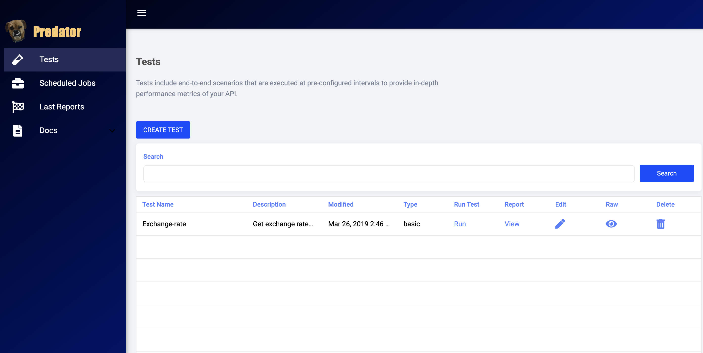

For official documentation on Predator, please refer to the [official product documentation](https://zooz.github.io/predator/index)

Predator is an open-source distributed performance testing framework. 

Predator manages the entire lifecycle of stress-testing a server, from creating a test file, to running scheduled and on-demand tests, and finally viewing the test results in a highly informative report. 

Bootstrapped with a user-friendly UI alongside a simple REST API, Predator helps developers simplify the performance testing regime.

This package installs an instance of Predator and makes it available for use by any other applications running in the cluster at the virtual address ***predator.marathon.l4lb.thisdcos.directory:80***, where "predator" is the value for service name and 80 is the port. 

**Table of Contents**:

- [Prerequisites](#prerequisites)
- [Install Predator](#install-predator-server)
  - [Validate installation](#validate-installation)
- [Access UI](#access-ui)
- [Use API](#use-api)
- [Uninstall](#uninstall)

# Prerequisites

- A running DC/OS v1.8 cluster with at least 1 private agent with at least 512MB of RAM and 1.5CPU available. This will be able to run Predator with 1 predator-runner that will generate load when running tests.
- For each additional predator-runner that is deployed to run a load test, an additional 128MB and 1CPU are recommended for optimal performance.
- Optionally, for data persistence, one of the following databases installed in the cluster: MySQL, Postgres, MSSQL.
    - If none of the following are installed, SQLite will be used and data will be lost on service restart.

# Install Predator

## Install Predator from the DC/OS UI

Log into DC/OS, go to Universe, and select the `predator` package from Universe. Simply click `Install` to accept the default installation parameters, or optionally Select `Advanced Installation` and configure the following parameters:

- `service / name`: Unique name of this service instance. Defaults to predator.

- `service / cpus`: CPU shares to allocate to this service instance. Defaults to 0.1.

- `service / mem`: Memory to allocate to this service instance in MB. Defaults to 256MB.

- `service / internal_address`: Address of this service accessible from inside of Metronome cluster. Defaults to <http://predator.marathon.l4lb.thisdcos.directory:80> 

- `service / metronome_url`: Metronome URL (used for API). Defaults to <http://metronome.mesos:9000>.

- `service / minimum_wait_for_delayed_report_status_update_in_ms`: The minimum of time waiting for runner to report before the test considered as finished in milliseconds. Defaults to 30000.

- `runner / cpu`: CPU shares to allocate to each predator-runner load generator deployed. Defaults to 1.

- `runner / memory`: Max memory allocated to each predator-runner in MB. Defaults to 2048MB. Can be cut down to 128MB.

- `runner / docker_name`: Docker image of predator-runner that runs predator tests. Defaults to zooz/predator-runner:latest (image located in Dockerhub registry.)

*NOTE*: If SQLite is the chosen database dialect, then data will not be persisted and will be **deleted** on every service restart.

- `database / type`: Type of database dialect [SQLITE/POSTGRES/MSSQL/MYSQL]. Defaults to SQLITE.

- `database / address`: Database address accessible from inside the cluster.

- `database / username`: Database username.

- `database / password`: Database password.

- `database / name`: Database/keyspace name.

Once the package is configured according to your installation and needs, click on "Review and Install", and finally on "Install".

## Install Predator from the DC/OS CLI

Log into a terminal where the DC/OS CLI is installed and has connectivity with the cluster. Install the package from the DC/OS CLI with the default values.

```bash
dcos package install --yes predator
```
If you want to modify any of the default installation values, create and save a `predator-options.json` file, then launch the Predator DC/OS package with:

```bash
dcos package install --yes --options ./predator-options.json predator
```

## Validate installation

### Validate from DC/OS UI

After installation, the package will be running under the `Services` tab

You can check the package instance’s correct functioning by clicking on the package name and looking at the task’s logs:

```
{"name":"predator","hostname":"ma-10-1-3-125.apps.mars.fra.zooz.internal","pid":1,"level":30,"msg":"sqlite client initialized","time":"2019-03-27T11:41:35.311Z","v":0}
{"name":"predator","hostname":"ma-10-1-3-125.apps.mars.fra.zooz.internal","pid":1,"level":30,"msg":"Predator listening on port 6590","time":"2019-03-27T11:41:35.545Z","v":0}
Received task health update, healthy: true
```

### Validate from DC/OS CLI

After installation, you can check the correct functioning with:

```bash
dcos package list | grep predator
predator     1.0.0           /predator   ---      Framework that manages the entire lifecycle of load testing a server, from creating test files, running scheduled and on-demand tests, and viewing test results. Github: https://github.com/zooz/predator | Docs: https://zooz.github.io/predator/                               

dcos marathon app list | grep predator
/predator    256   0.2    1/1    1/1     ---      False      DOCKER   None   
```

### Validate from Predator API

After installation, you will be able to use Predator's API.

To check health, GET `{{$service.external_address}}/health`, if correctly installed, you should receive:

`{ status: 'OK' }`

# Access Predator UI

Once Predator is installed, open its UI by accessing `{{$service.external_address}}/predator`



# Use Predator API

API Reference can be accessed [here](https://zooz.github.io/predator/#apireference.html)

# Uninstall

To uninstall Predator:

```bash
dcos package uninstall predator
```

## Further resources

1. [Predator Github page](https://github.com/Zooz/predator)
2. [Predator first test help guide and documentation](https://zooz.github.io/predator/index)
3. [Predator API Reference](https://zooz.github.io/predator/#apireference.html)