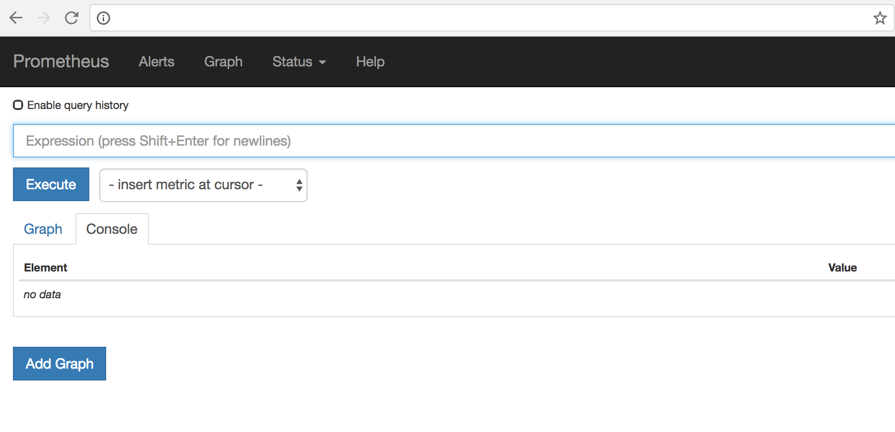

# How to use Prometheus with DC/OS

## Prerequisites

* A running DC/OS 1.11 cluster

## Install

Prometheus can be installed via either the DC/OS Catalog UI or by using the CLI. The following command will launch the install via the DC/OS CLI:

```bash
dcos package install prometheus
```

Install Grafana from the service catalog as well. It can be used as a graphing tool.
```bash
dcos package install --yes grafana
```


The framework provides options to enter the Prometheus, AlertManager and Rules config. The default prometheus config scrapes DC/OS master and agents in the clusters. Append any new config to the end.

## Accessing the Prometheus UI

Once the framework is up and running:
Install edge-lb.
Create a file named prometheus-edgelb.json containing the following edge-lb configuration.

```
{
  "apiVersion": "V2",
  "name": "prometheus",
  "count": 1,
  "haproxy": {
    "frontends": [
      {
        "bindPort": 9092,
        "protocol": "HTTP",
        "linkBackend": {
          "defaultBackend": "prometheus"
        }
      },
      {
        "bindPort": 9093,
        "protocol": "HTTP",
        "linkBackend": {
          "defaultBackend": "alertmanager"
        }
      },
      {
        "bindPort": 9094,
        "protocol": "HTTP",
        "linkBackend": {
          "defaultBackend": "grafana"
        }
      },
      {
        "bindPort": 9091,
        "protocol": "HTTP",
        "linkBackend": {
          "defaultBackend": "pushgateway"
        }
      }
    ],
    "backends": [
     {
      "name": "prometheus",
      "protocol": "HTTP",
      "services": [{
        "endpoint": {
          "type": "ADDRESS",
          "address": "prometheus.prometheus.l4lb.thisdcos.directory",
          "port": 9090
        }
      }]
    },
    {
     "name": "alertmanager",
     "protocol": "HTTP",
     "services": [{
       "endpoint": {
         "type": "ADDRESS",
         "address": "alertmanager.prometheus.l4lb.thisdcos.directory",
         "port": 9093
       }
     }]
   },
   {
    "name": "grafana",
    "protocol": "HTTP",
    "services": [{
      "endpoint": {
        "type": "ADDRESS",
        "address": "grafana.grafana.l4lb.thisdcos.directory",
        "port": 3000
      }
    }]
   },
   {
    "name": "pushgateway",
    "protocol": "HTTP",
    "services": [{
      "endpoint": {
        "type": "ADDRESS",
        "address": "pushgateway.prometheus.l4lb.thisdcos.directory",
        "port": 9091
      }
    }]
   }
   ]
  }
}

```

In your browser enter the following address.

Promtheus UI:
```
http://<public-agent-ip>:9092
```



This is the console view within the `Graph` tab.

You can also verify that Prometheus is serving metrics about itself by navigating to its metrics endpoint:

```
http://<public-agent-ip>:9092/metrics
```

### Using the Expression browser

Go back to the console view, and enter this into the expression console:

`prometheus_target_interval_length_seconds`

This should return a number of different time series (along with the latest value recorded for each), all with the metric name prometheus_target_interval_length_seconds.

As another example, enter the following expression to graph the per-second rate of chunks being created in the self-scraped Prometheus:

`rate(prometheus_tsdb_head_chunks_created_total[1m])`


## Using Grafana with Prometheus

```
http://<public-agent-ip>:9094
```

Credentials: admin / admin


which takes you to the Grafana console.


You can add Prometheus as a data source:


Save and Test. Now youre ready to use Prometheus as a data source in Grafana.

To create a graph, select your `Prometheus` datasource, and enter any Prometheus expression into the "Query" field, while using the "Metric" field to lookup metrics via autocompletion.

The following shows an example Prometheus graph configuration:


## AlertManager

The Alertmanager handles alerts sent by client applications such as the Prometheus server. It takes care of deduplicating, grouping, and routing them to the correct receiver integration such as email, PagerDuty, or OpsGenie. It also takes care of silencing and inhibition of alerts.

AlertManager UI:
```
http://<public-agent-ip>:9093
```


### AlertManager with Webhook
The default configuration for AlertManager (these configs can be changed) in the framework is configured with a webhook receiver:

```
route:
 group_by: [cluster]
 receiver: webh
 group_interval: 1m

receivers:
- name: webh
  webhook_configs:
  - url: http://webhook.marathon.l4lb.thisdcos.directory:1234
```

Default rule defined in the framework:

```
groups:
- name: cpurule
  rules:
  - alert: highcpu
    expr: cpu_total > 2
    annotations:
      DESCRIPTION: 'it happened yeah'
      SUMMARY: 'it happened'
```


Next, run the following config as a marathon app:

```
{
    "container": {
        "docker": {
            "image": "python:latest"
        },
        "type": "MESOS"
    },
    "mem": 1024,
    "portDefinitions": [
        {
            "labels": {
                "VIP_0": "webhook:1234"
            },
            "protocol": "tcp",
            "name": "web",
            "port": 1234
        }
    ],
    "cmd": "env | sort\n\ncat > function.py << EOF\n\nimport sys\nimport cgi\nimport json\nimport pipes\nfrom BaseHTTPServer import BaseHTTPRequestHandler, HTTPServer\n\n\nclass MyHandler(BaseHTTPRequestHandler):\n   def do_POST(self):\n       self.send_response(200)\n       self.end_headers()\n       #data = json.loads(self.rfile.read(int(self.headers['Content-Length'])))\n       data = self.rfile.read(int(self.headers['Content-Length']))\n       self.log_message('%s', data)\n\n\nhttpd = HTTPServer(('0.0.0.0', $PORT_WEB), MyHandler)\nhttpd.serve_forever()\nEOF\n\npython2 function.py\n",
    "networks": [
        {
            "mode": "host"
        }
    ],
    "cpus": 0.1,
    "id": "webhook"
}
```

Check the logs for this app. The Alertmanager will send HTTP POST requests in the following JSON format:

```
{
  "receiver": "webh",
  "status": "firing",
  "alerts": [
    {
      "status": "firing",
      "labels": {
        "alertname": "highcpu",
        "cluster_id": "4c7ab85b-ce28-4bdd-8a2d-87c71d02759e",
        "hostname": "10.0.1.16",
        "instance": "10.0.1.16:61091",
        "job": "dcos-metrics",
        "mesos_id": "29bac9b2-cbdb-4093-a907-6c4904a1360a-S5"
      },
      "annotations": {
        "DESCRIPTION": "it happened yeah",
        "SUMMARY": "it happened"
      },
      "startsAt": "2018-07-12T17:32:56.030479955Z",
      "endsAt": "0001-01-01T00:00:00Z",
      "generatorURL": "http://ip-10-0-1-16.us-west-2.compute.internal:1025/graph?g0.expr=cpu_total+%3E+2&g0.tab=1"
    },
...
...
...
}
```

### AlertManager with Slack

Slack notifications are sent via Slack webhooks. Update the AlertManager config to :

```
route:
 group_by: [cluster]
 # If an alert isn't caught by a route, send it slack.
 receiver: slack_general
 routes:
  # Send severity=slack alerts to slack.
  - match:
      severity: slack
    receiver: slack_general

receivers:
- name: slack_general
  slack_configs:
  - api_url: <Slack webhook URL>
    channel: '#alerts_test'
```


## PushGateway

The Prometheus Pushgateway exists to allow ephemeral and batch jobs to expose their metrics to Prometheus.

Pushing some metrics:
Push a single sample into the group identified by {job="some_job"}:

```
echo "some_metric 3.14" | curl --data-binary @- http://pushgateway.example.org:9091/metrics/job/some_job
```


