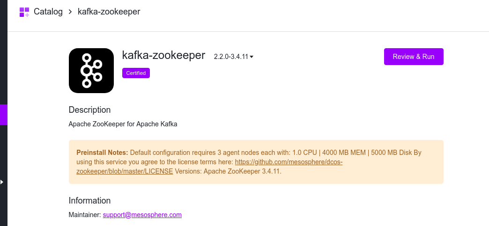
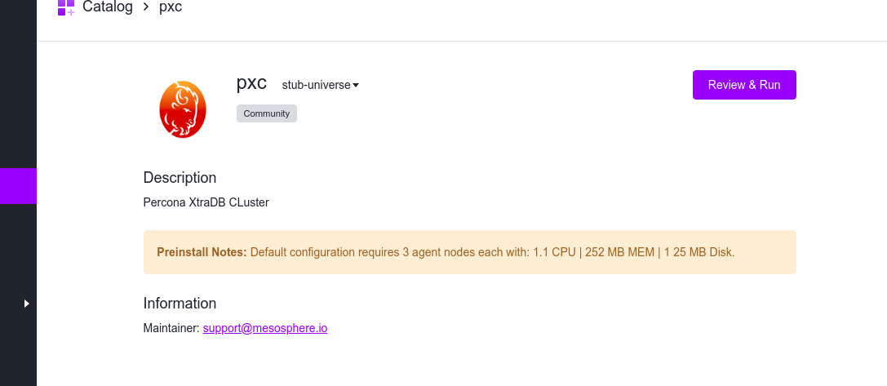

# How to use PXC with DC/OS

## Prerequisites

* A running DC/OS 1.11 cluster

## Install

Before starting with installation of PXC, we need to install the kafka-zookeeper service on the same DC/OS cluster. Please refer kafka-zookeeper service docs as installation guide.

For a basic kafka-zookeeper install from command line we need to use the following command:

```bash
dcos package install kafka-zookeeper
```

and via DC/OS UI, kafka-zookeeper can be installed as shown below:



PXC can be installed via either the DC/OS Catalog UI or by using the CLI. The following command will launch the install via the DC/OS CLI:

```bash
dcos package install pxc
```



In either case a default cluster will come up with three PXC nodes and one ProxySQL node on the public DC/OS cluster node. 

It is recommended to have nodes in odd number count for PXC to avoid condition of split brain.


## Accessing the Console

Once the cluster is up and running, we need to have a mysql client version 5.7 on our local system to connect to the pxc cluster.

We also need to find out Public facing DC/OS cluster hostname/IP for connecting from the mysql client.

In our case since our DC/OS cluster is deployed on AWS infrastructure, we need to get the EC2 instance in the DC/OS cluster which is part of the "PublicSlaveSecurityGroup"

Hence we us the following command using mysql client to connect to the PXC cluster on DC/OS :

```bash
root@bf7132b3a085:/# mysql -uproxysql_user -ppassw0rd -h 18.179.47.46 -P 3306
mysql: [Warning] Using a password on the command line interface can be insecure.
Welcome to the MySQL monitor.  Commands end with ; or \g.
Your MySQL connection id is 17
Server version: 5.5.30 (ProxySQL)

Copyright (c) 2000, 2018, Oracle and/or its affiliates. All rights reserved.

Oracle is a registered trademark of Oracle Corporation and/or its
affiliates. Other names may be trademarks of their respective
owners.

Type 'help;' or '\h' for help. Type '\c' to clear the current input statement.

mysql> 

```

Now we can check the pxc cluster values using the following command:

```bash

mysql> show databases;
+--------------------+
| Database           |
+--------------------+
| information_schema |
+--------------------+
1 row in set (0.12 sec)

mysql> select 1;
+---+
| 1 |
+---+
| 1 |
+---+
1 row in set (0.14 sec)


```


Now we need to add more query rules in the proxysql service by connecting to it by referring to https://github.com/sysown/proxysql/wiki/ProxySQL-Configuration.  

We will also need to get the proxysql endpoint hostname for connecting to it from the task using the below command:

```bash
dcos pxc endpoints lb-port
```

To connect to the proxysql service running on the cluster, we need to get the  task id for proxysql service using the below command.

```bash
$ dcos task
```
Then we need to get into the proxysql task by assigning bash shell to it in the following way

```bash
dcos task exec -ti proxysql-0-proxysql-task__cc6eb6cd-054e-460f-9a9b-842bda3930a4 bash
```

From the proxysql task we need to connect to the proxysql service using the below command:

```bash
mysql -uradminuser -pradminpass -h proxysql-0-proxysql-task.pxc.autoip.dcos.thisdcos.directory -P 6032
mysql: [Warning] Using a password on the command line interface can be insecure.
Welcome to the MySQL monitor.  Commands end with ; or \g.
Your MySQL connection id is 82334
Server version: 5.5.30 (ProxySQL Admin Module)

Copyright (c) 2009-2018 Percona LLC and/or its affiliates
Copyright (c) 2000, 2018, Oracle and/or its affiliates. All rights reserved.

Oracle is a registered trademark of Oracle Corporation and/or its
affiliates. Other names may be trademarks of their respective
owners.

Type 'help;' or '\h' for help. Type '\c' to clear the current input statement.

mysql>     
```
Now we can setup query rules following the above mentioned link for proxysql configuration.


## Adding Nodes

Let’s say we have two data nodes, and we want to go to three.


You need to go and edit the configuration of your couchbase service, and increase the data node count to 3.


