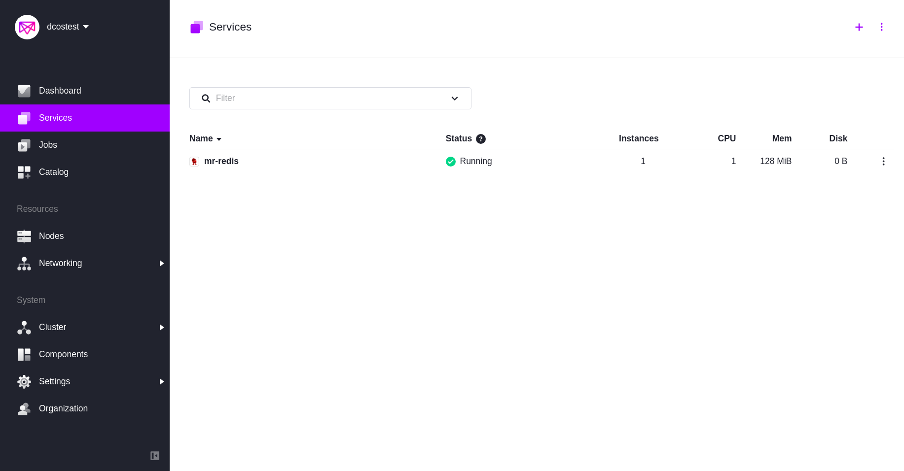

# How to use Redis on DC/OS

[Redis](http://redis.io/) is a popular in-memory data structure store, used as database, cache and message broker.

- Estimated time for completion: 5 minutes
- Target audience: Anyone interested using an in-memory data store.
- Scope: Learn how to use Redis on DC/OS

Note, that there are two different DC/OS services for Redis:
- Redis: A single Redis container, easy to install and test but not suited for production workloads.
- mr-redis: A framework allowing you to mange multiple Redis datastores standalone or in a clustered setup.

**Table of Contents**:


- [Prerequisites](#prerequisites)
- [Use single container Redis service](#single-container-redis)
- [mr-redis framework](#mr-redis)
- [Install mr-redis](#install-mr-redis)
- [Create a Redis instance](#create-a-redis-instance)
- [Access the Redis instance](##access-the-redis-instance)
- [Uninstall mr-redis](#uninstall-mr-redis)

## Prerequisites

- A running DC/OS 1.11 cluster with at least 2 nodes with 1 CPU and 300MB of RAM available.
- [DC/OS CLI](https://docs.mesosphere.com/1.11/cli/install/) installed.

## Single container Redis
Note, that this service is targeted at testing Redis and not for production workloads!
You can install the single Redis container with a simple `dcos package install redis`.
Then the easiest option to test Redis is by storing a key manually via the redis-cli
- SSH into node where Redis is running: 
``` bash 
dcos node ssh --master-proxy --mesos-id=$(dcos task redis --json | jq -r '.[] | .slave_id')
```
NOTE: This requires you to have the ssh-key required to connect to the machines added to your local ssh agent (e.g., via ssh-add my_public_key).
- Because Redis is running in docker container, we can list all docker containers using docker ps and get the ContainerID.
- Connect to a bash session to the running container: `sudo docker exec -it CONTAINER_ID /bin/bash`
- Start the Redis CLI: redis-cli
  - Set key:
    - `set mykey key1`
  - Check value: 
    - `get mykey`
Now we can uninstall Redis: `dcos package uninstall redis`.

##  mr-redis
The DC/OS service [mr-redis](https://github.com/mesos/mr-redis), maintained by [Huawei](http://www.huawei.com/en/)
is a Mesos framework allowing you to manage Redis datastores standalone or in a clustered setup.

## Install mr-redis

To install mr-redis from the DC/OS CLI, do the following:

```bash
$ dcos package install mr-redis
By Deploying, you agree to the Terms and Conditions https://mesosphere.com/catalog-terms-conditions/#community-services
This DC/OS Service is currently in preview. In order for redis framework to start successfully it requires atleast 1 CPU and 128MB of RAM including ports.
Note that the service is alpha and there may be bugs, including possible data loss, incomplete features, incorrect documentation or other discrepancies.
Continue installing? [yes/no] yes
Installing Marathon app for package [mr-redis] version [0.0.1]
Once the cluster initializes download cli from https://github.com/mesos/mr-redis/releases/download/v0.01-alpha/mrr and follow the instructions in github.com/mesos/mr-redis README on how to initialize the cli, you could also use the REST api's directly to create redis instances
```
To validate that the mr-redis service is running and healthy you can go to the DC/OS UI:



Note that the mr-redis framework scheduler is serving on `mrredis.mesos:5656`.

## Create a Redis instance


While the mr-redis service we installed in the previous step is capable of supervising Redis instances, now you will need to use the API available on `mrredis.mesos:5656`, from within the DC/OS cluster, will create a Redis instance with the name `test`, a memory capacity of 100 MB and 3 Redis slaves, make the following request to the API:

```bash
$ dcos node ssh --master-proxy --leader

core@ip-10-0-4-255 ~ $ curl -X POST mrredis.mesos:5656/v1/CREATE/test/100/1/3
Request Accepted, Instance will be created. 
```

To validate if the Redis Master and the three Redis slaves have been created and to discover their endpoints, execute the following request to the scheduler:

```bash
core@ip-10-0-4-255 ~ $ curl -s mrredis.mesos:5656/v1/STATUS/test | jq .
{
  "Name": "test",
  "Type": "MS",
  "Status": "RUNNING",
  "Capacity": 100,
  "Master": {
    "IP": "10.0.2.40",
    "Port": "6380",
    "MemoryCapacity": 100,
    "MemoryUsed": 1925360,
    "Uptime": 21,
    "ClientsConnected": 1,
    "LastSyncedToMaster": 0
  },
  "Slaves": [
    {
      "IP": "10.0.2.40",
      "Port": "6381",
      "MemoryCapacity": 100,
      "MemoryUsed": 834904,
      "Uptime": 17,
      "ClientsConnected": 2,
      "LastSyncedToMaster": 1
    },
    {
      "IP": "10.0.0.129",
      "Port": "6381",
      "MemoryCapacity": 100,
      "MemoryUsed": 834904,
      "Uptime": 17,
      "ClientsConnected": 2,
      "LastSyncedToMaster": 2
    },
    {
      "IP": "10.0.0.129",
      "Port": "6380",
      "MemoryCapacity": 100,
      "MemoryUsed": 834904,
      "Uptime": 17,
      "ClientsConnected": 2,
      "LastSyncedToMaster": 2
    }
  ]
}
```

## Access the Redis instance

Once you've created the Redis instance, you will want to try it out. We will use [redis-cli](https://hub.docker.com/_/redis/) to send Redis [commands](http://redis.io/commands) to the Redis instance we've set up previously.

To access and test the Redis instance, do the following (within the DC/OS cluster and using your own Redis Master address, `10.0.2.40:6380` in our example):

```bash
core@ip-10-0-4-255 ~ $ docker run -it --rm redis:4-alpine redis-cli -h 10.0.2.40 -p 6380
Unable to find image 'redis:4-alpine' locally
4-alpine: Pulling from library/redis
ff3a5c916c92: Pull complete 
aae70a2e6027: Pull complete 
87c655da471c: Pull complete 
7f8fb829cc48: Pull complete 
c72e0cff027d: Pull complete 
276d6b52cd5b: Pull complete 
Digest: sha256:8782054ba81c3b8b969dae4822263a97fc241a06f8f1fe1acacd7c077ec60831
Status: Downloaded newer image for redis:4-alpine
10.0.2.40:6380> PING
PONG
10.0.2.40:6380> SET somekey somevalue
OK
10.0.2.40:6380> GET somekey
"somevalue"
10.0.2.40:6380> SET anotherkey :1
OK
10.0.2.40:6380> GET anotherkey
":1"
10.0.2.40:6380> QUIT
```

## Delete Redis instances

```bash
core@ip-10-0-4-255 ~ $ curl -X DELETE mrredis.mesos:5656/v1/DELETE/test
Request Placed for destroying
```

## Uninstall mr-redis

To uninstall mr-redis and all instances created:

```bash
$ dcos package uninstall mr-redis
```

## Further resources

1. [DC/OS mr-redis Official Documentation](https://github.com/mesos/mr-redis)
2. [Redis commands](http://redis.io/commands)
3. [Redis protocol](http://redis.io/topics/protocol)
