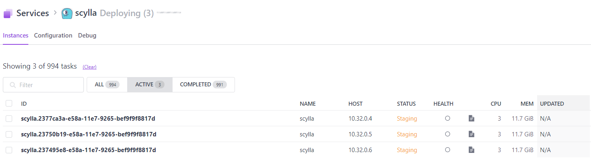
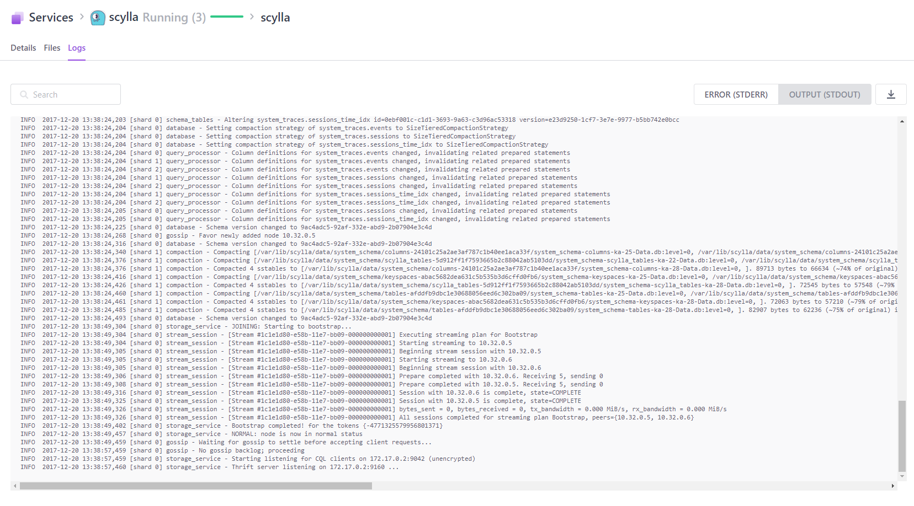

# Getting started with ScyllaDB on DC/OS

[ScyllaDB](https://scylladb.com) is a drop-in Apache Cassandra replacement that powers your applications with ultra-low latency and extreme throughput. Leveraging the best from Apache Cassandra in high availability, fault tolerance, and its rich ecosystem, Scylla offers developers a dramatically higher-performing and resource effective NoSQL database to power modern and demanding applications.

**Table of Contents**:

- [Prerequisites](#prerequisites)
- [Installing ScyllaDB](#installing-scylladb)
  - [Service](#service)
  - [General](#general)
  - [Disks](#disks)
  - [Network](#network)
  - [Security](#security)
  - [Validate installation](#validate-installation)
- [Uninstall](#uninstall)

## Prerequisites

- A running DC/OS 1.10 cluster 
- At least 4 Gb of memory and 1.0 CPU shares available on each node that you want to run Scylla on

## Installing ScyllaDB
Scylla on DC/OS demands to be manually configured before deployment. So in order to get started, head over to the DC/OS catalog find the ScyllaDB package and press *Configure* to get started.

### Service
In Service we define the basics of each container we will deploy on DC/OS:  
**Name** - application name that we will use as reference with the DC/OS CLI for example.  
**Nodes** - number of nodes in your ScyllaDB cluster. This can be scaled up and down later, however the number of seed nodes can not be changed from the inital number.  
**SMP** - the number of CPU cores each ScyllaDB instance will have. From DC/OS 1.10 the [CFS scheduler](https://github.com/mesosphere/marathon/blob/master/docs/docs/cfs.md) is implemented.
**Memory** - the amount of memory per instance in Mb. Try to keep the guidelines in the [ScyllaDB documentation](http://docs.scylladb.com/getting-started/system-requirements/) when it comes to Mem/CPU ratio.

### General
Notes on the general settings:  
**Overprovisioned** - should generally be set to true, since we are launching Scylla in containers, unless you plan to give Scylla a whole node to itself without other processes running.  
**Developer mode** - should be set to false since the aim of this package is to run in production. Use only if you want to try out different combinations of features before launching the real deal.  
**Experimental** - same here. Should not be run in production.  
**Number of seeds** - make sure this is set to a number lower than the total amount of nodes launch. Otherwise the deployment will fail. 
**Each node is a new rack** - by enabling this, each instance will be assigned a new rack id. This is good from a snitch point of view. But obviously it depends on your local/cloud setup of nodes.
**Data center name** - will be the name of the data center you are launching. For now, it is only possible to launch one data center at the time. 

### Disks
It is recommended to run Scylla on host mounted, dedicated disks that are XFS formatted for optimal performance. Assuming you have some hosts dedicated for Scylla starting with ip 10.1.\* and a disk /dev/sdc you can create a script *run.sh*:
```
#!/bin/bash
curl http://leader.mesos:1050/system/health/v1/nodes | jq '.nodes[].host_ip' | sed 's/\"//g' | sed '/172/d' > allnodes
hosts=($(cat nodes | grep 10.1.))
disk=/dev/sdc
for i in "${hosts[@]}"
do
        scp disks.sh laketide@$i:~/
        ssh laketide@$i -o StrictHostKeyChecking=no "sudo bash ~/disks.sh /dev/sdc"
        echo $i >> configurednodes
done
``` 
and a another script in the same directory *disks.sh*:
```
#!/bin/bash
sed -e 's/\s*\([\+0-9a-zA-Z]*\).*/\1/' << EOF | sudo fdisk $1
        n
        p
        1


        w
        q
EOF
disk="${1}1"
sudo mkfs.xfs -f $disk
sudo mkdir -p /mnt/scylla
sudo mount -t xfs $disk /mnt/scylla
sudo mkdir -p /mnt/scylla/{data,commitlog,keys}
sudo chmod -R 644 /mnt/scylla
echo "Disk $disk formatted as xfs and mounted at /mnt/scylla"
```
This will give you a mounted XFS disk on each node starting with ip 10.1 in the cluster at /mnt/scylla.  

##### Local persistent volumes
If you insist on using the DC/OS local persistence you should check out the documentation before to know the pros and cons of this setting: https://dcos.io/docs/1.10/storage/persistent-volume/

### Network
Setting the ports to other ones than the defaults will only change how you contact the application from outside. It will be equivalent to running `docker run -p YourNewPort:9042 -p YourOtherPort:9160`.  

##### External access port
Since the [DC/OS architecture](https://dcos.io/docs/1.10/overview/architecture/node-types/) consists of private and public nodesthe default behaviour is to deploy applications on the private nodes and use [Marathon-LB](https://dcos.io/docs/1.10/networking/marathon-lb/) as the exposer of a service. This is not ideal from a ScyllaDB perspective since it has its own load balancer internally to handle requests. However, it does provide some extra security by letting all instances reside on private nodes. For now, Scylla will by default utilize Marathon-LB but might in the future allow placing Scylla instances on public nodes.  
**Remember** to open up your firewall for the external port if used. 

### Security
The Scylla package allows you to configure Authentication, TLS between nodes and between node and client.  
**Authentication** - if you set *PasswordAuthenticator*, Scylla will automatically set the authorizer as well to *CassandraAuthorizer. This means that you will also have to configure each new created keyspace and table for access rights. The default user `cassandra` will have all rights initially.  
**Node and client TLS** - start by [generating keys and certificates](http://docs.scylladb.com/tls-ssl/) and make sure to name them *scylladb.crt*, *scylladb.key* and *ca-scylladb.pem*. Place them in a directory that is the same for all nodes (for example /mnt/scylla/keys) and make sure they are readable for Scylla.  
If you already have the keys available at some place other than on the hosts of DC/OS, you can use Mesos to pull these into the container and extract them to $MESOS_SANDBOX inside the container. Here you have the opportunity to pull any zipped or tared file from either the host or from an arbitray URI and have it automatically unpacked and utilized by Scylla.


### Validate installation
Once you have set all your configs and started the deployment, head over to the launching of the cluster and look at STDOUT. It takes some time to launch Scylla for production since it is running a comprehensive IO setup. When STDOUT looks like:  

the health check will soon become green and you are ready to rock!

Now, head over to any node running Scylla and run:  
```
docker exec -it $SCYLLA_DOCKER_ID nodetool status
```
and you should see your newly created cluster.  
Now it's time to get busy using CQL and create some keyspaces, tables etc. If you used *PasswordAuthenticaton* in your cluster you can now run
```
docker exec -it $SCYLLA_DOCKER_ID cqlsh -u cassandra -p cassandra
```
Now you can start interacting with Scylla programatically using your language of choice. Here is example drivers for Python and Julia:  
https://datastax.github.io/python-driver/  
https://github.com/r3tex/CQLdriver.jl  
