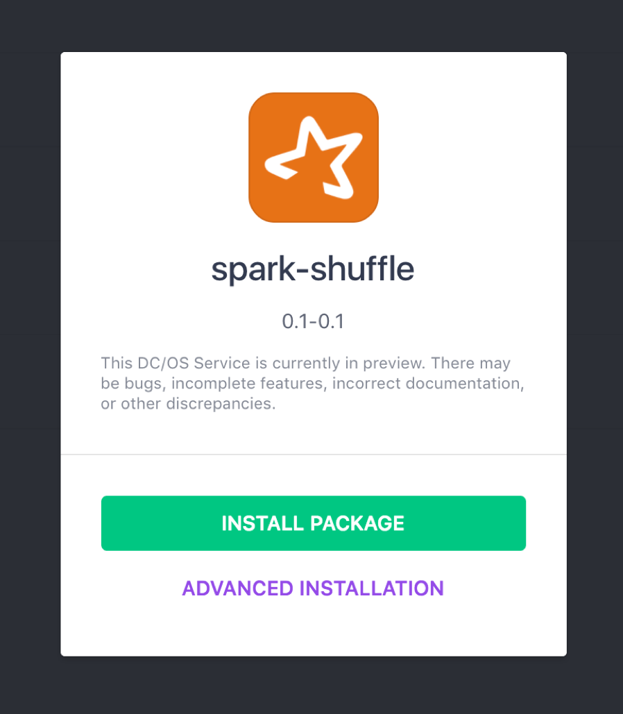

# Spark Shuffle deployment on DC/OS

[Spark Shuffle](https://github.com/NBCUAS/dcos-spark-shuffle-service) allows to use dynamic allocation in Spark jobs. In order to use Spark shuffle, an instance should be running on each one of the agents. This package uses Mesos constraints to install a single copy per private agent and initially launches 256 instances. This means that you will get a single copy per private agent, and the remaining copies until 256 will stay in a "Waiting" state initially. If you want to remove the "Waiting" state, you can adjust the number of instances in the deployment to exactly the number of private agents in your cluster to make sure the deployment completes.

The Spark Shuffle agent package can be installed to DC/OS setups using the official package from the DC/OS universe.

* **Estimated time for completion**: 2 minutes
* **Scope**: Learn how to install the Spark Shuffle agent on a DC/OS Cluster.

## Prerequisites

* A running DC/OS 1.8 cluster

## Deploying the Spark Shuffle agent

In order to install the Spark Shuffle agent, go to the Universe listing in the DC/OS web UI, and **click on "Install"** on the Spark Shuffle service list item.

## Adjusting the number of instances of Spark Shuffle

This package uses Mesos constraints to install a single copy per private agent and initially launches 256 instances. This means that you will get a single copy per private agent, and the remaining copies until 256 will stay in a "Waiting" state initially. If you want to avoid the "Waiting" state, you can adjust the number of instances in the deployment to exactly the number of private agents in your cluster to make sure the deployment completes.

In order to do that, you can go to the "Services" tab, click on the Spark Shuffle service, and select the service "Configuration". You can adjust the number of instances to the number of private nodes in your cluster. After that, the service should be in Running state.
