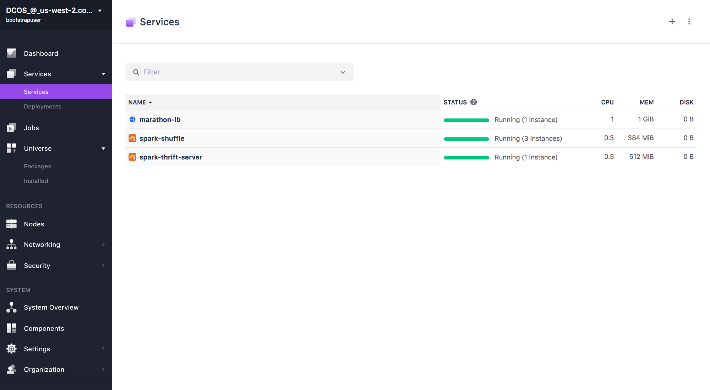

# How to use Spark Thrift Server on DC/OS

[Spark Thrift Server](https://jaceklaskowski.gitbooks.io/mastering-apache-spark/content/spark-sql-thrift-server.html) Thrift JDBC/ODBC Server (aka Spark Thrift Server or STS) is Spark SQL’s port of Apache Hive’s HiveServer2 that allows JDBC/ODBC clients to execute SQL queries over JDBC and ODBC protocols on Apache Spark.

With Spark Thrift Server, business users can work with their shiny Business Intelligence (BI) tools, e.g. Tableau or Microsoft Excel, and connect to Apache Spark using the ODBC interface. That brings the in-memory distributed capabilities of Spark SQL’s query engine (with all the Catalyst query optimizations you surely like very much) to environments that were initially "disconnected".

Besides, SQL queries in Spark Thrift Server share the same SparkContext that helps further improve performance of SQL queries using the same data sources.

#Dynamic Allocation

The Spark Thrift Service is setup uses dynamic executor allocation by default. This requires to have an instance of the Spark Shuffle Service running. You can see an example of how to install Spark Shuffle at https://github.com/dcos/examples/tree/master/spark-shuffle/1.9

- Estimated time for completion: 15 minutes
- Target audience: Anyone interested in using standard BI tools to process information with Spark using an ODBC interface
- Scope: Learn how to install Spark Thrift Server, and connect to it.

## Prerequisites

- A running DC/OS >= 1.8 cluster with at least 1 node having at least 0.5 CPUs and 1 GB of RAM available.
- [DC/OS CLI](https://dcos.io/docs/1.8/usage/cli/install/) installed.
- A running [Spark Shuffle](https://github.com/NBCUAS/dcos-spark-shuffle-service) instance (can be installed from the DC/OS Universe).

## Install Spark Thrift Server

### Via Universe package

Make sure you have a running Spark Shuffle service in your cluster. Otherwise, simply browse to the Universe app store on your DC/OS UI, select and install the Spark Shuffle package before installing the Spark Thrift Server. Default parameters should be fine.

Browse to the Universe in your DC/OS UI and select the Spark Thrift Server package.


Optionally, you may select "Advanced Installation" to tweak the package parameters, including the memory used for executors and driver, number of cores or number of executors, for example. You can also optionally select to expose the service in Marathon-LB for consumption from outside the cluster by checking the "External Access" checkbox.


Once you've selected the desired configuration parameters, proceed to the installation and wait until the service is in "Running" state



Assuming the default name (`spark-thrift-server`) and port number (`9000`) are used, the service will be available for other workloads *inside* the cluster in the virtual IP:

```bash
spark-thift-server.marathon.l4lb.thisdcos.directory:9000
```

If "external access" is selected (as it is by default), the service will also be available in port 9000 of the public node if running Marathon-LB. If your public node is being firewalled, please make sure to allow traffic to port 9000 (or whichever port you select in Advanced Install) to it.

## Usage

You can use the Spark Thrift Server from workloads running inside the cluster from outside of it (if "external access" was left selected). This example shows how to use the Beeline JDBC client to check the service correct functioning.

If your cluster is running Marathon-LB, you can access the service from a computer with IP connectivity to the public node on port 9000. In order to use the Beeline JDBC client to test the Spark Thrift Server in any node where the Docker runtime is installed, you can use the following command:

```bash
export PUBLIC_NODE_IP=<enter your public node's IP address here>
docker run --rm -ti --net=host --entrypoint=./beeline.sh sutoiku/beeline:hive-1.2.0 -u jdbc:hive2://$PUBLIC_NODE_IP:9000/default

```

If external access is not enabled, or if you'd rather test access to the Spark Thrift Server from inside the cluster, you can run from any master or agent node in the cluster (assuming a default service name of "spark-thrift-server":

```bash
docker run --rm -ti --net=host --entrypoint=./beeline.sh sutoiku/beeline:hive-1.2.0 -u jdbc:hive2://spark-thrift-server.marathon.l4lb.thisdcos.directory:9000/default

```

Either way, once the docker image has been downloaded, you should see an output similar to the following

```bash
$ docker run --rm -ti --net=host --entrypoint=./beeline.sh sutoiku/beeline:hive-1.2.0 -u jdbc:hive2://$PUBLIC_NODE_IP:9000/default
Starting beeline for 1.2.0
CLASSPATH lib/commons-cli-1.2.jar:lib/hadoop-common-2.7.3.jar:lib/hive-beeline-1.2.0-fetchSize.jar:lib/hive-jdbc-1.2.0-standalone.jar:lib/jline-2.12.jar:lib/super-csv-2.2.0.jar
Connecting to jdbc:hive2://34.210.208.43:9000/default
May 21, 2017 3:53:22 PM org.apache.hive.jdbc.Utils parseURL
INFO: Supplied authorities: 34.210.208.43:9000
May 21, 2017 3:53:22 PM org.apache.hive.jdbc.Utils parseURL
INFO: Resolved authority: 34.210.208.43:9000
SLF4J: Failed to load class "org.slf4j.impl.StaticLoggerBinder".
SLF4J: Defaulting to no-operation (NOP) logger implementation
SLF4J: See http://www.slf4j.org/codes.html#StaticLoggerBinder for further details.
May 21, 2017 3:53:22 PM org.apache.hive.jdbc.HiveConnection openTransport
INFO: Will try to open client transport with JDBC Uri: jdbc:hive2://34.210.208.43:9000/default
Connected to: Spark SQL (version 2.1.0)                       <----- THIS MEANS CONNECTION SUCCEEDED
Driver: Hive JDBC (version 1.2.0)
Transaction isolation: TRANSACTION_REPEATABLE_READ
Beeline version 1.2.0 by Apache Hive
0: jdbc:hive2://34.210.208.43:9000/default>
```

This means the Spark Thrift Server is now ready to use by any JDBC/ODBC driver.

