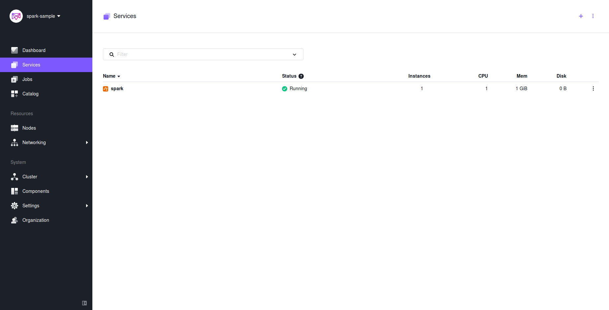
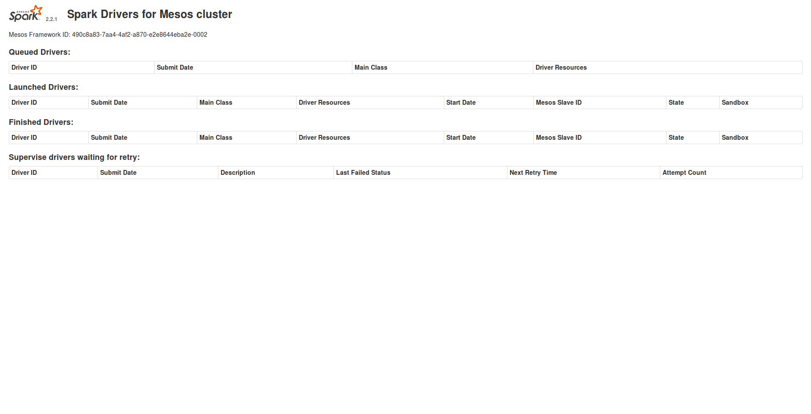
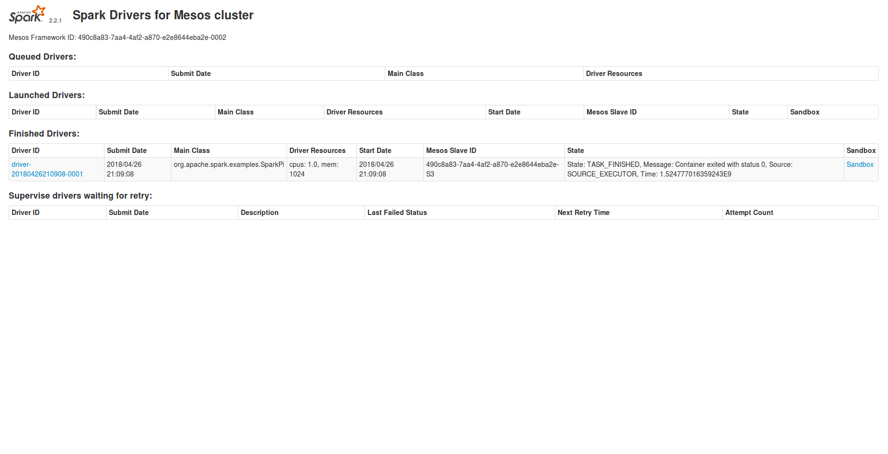
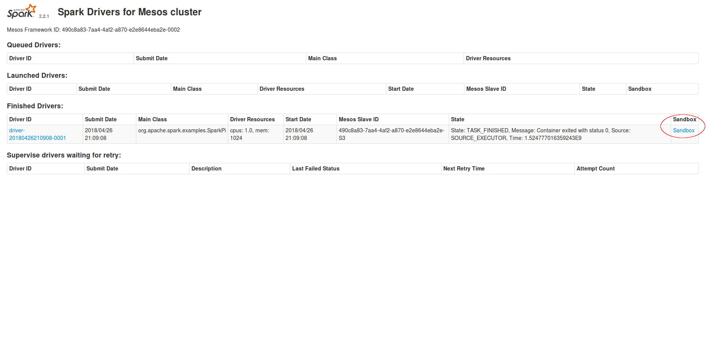
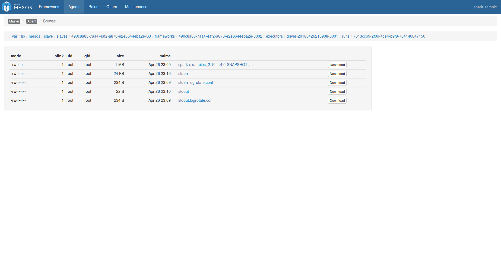

# How to use Apache Spark on DC/OS

[Apache Spark](https://spark.apache.org/) is a general-purpose data processing engine. It supports batch and stream processing and comes with built-in APIs for SQL, machine learning and graph workloads. Spark is storage-layer agnostic, meaning it doesn't come with its own storage system but provides connectors to read data from and write data into, for example, the local filesystem, HDFS, Kafka, Cassandra, Elasticsearch, and HBase.

- Estimated time for completion: 10 minutes
- Target audience: Anyone interested in a data processing engine.
- Scope: Learn how to install Spark on DC/OS and how to launch a Spark job. 

**Terminology**:

- **Application** ... A program built on Spark, consisting of a driver program and executors in the cluster.
- **Driver** ... A process running the `main()` function of the application (and providing the SparkContext).
- **Executor** ... A process launched for an application on a worker node.
- **Mesos run modes** ... Spark can run in Mesos using two modes: `coarse-grained` (default) and `fine-grained`. The `coarse-grained` mode has a lower startup overhead and is good for interactive sessions; it launches one long-running Spark task on each worked node at the cost of reserving the resources for the complete duration of the application. The `fine-grained` mode shows better resource utilization and is good for batch and certain streaming jobs; it launches each Spark task as a separate Mesos task. Note that `fine-grained` mode was [deprecated](https://spark.apache.org/docs/latest/running-on-mesos.html#fine-grained-deprecated) as of Spark 2.0.0.

**Table of Contents**:

- [Prerequisites](#prerequisites)
- [Install Spark](#install-spark)
- [Launch a Spark job](#launch-a-spark-job)
- [Uninstall Spark](#uninstall-spark)

## Prerequisites

- A running DC/OS 1.11 cluster with at least 3 nodes with each 2 CPUs and 2 GB of RAM available.
- [DC/OS CLI](https://dcos.io/docs/1.11/cli/install/) installed.

## Install Spark

Assuming you have a DC/OS cluster up and running, the first step is to install Spark:

```bash
$ dcos package install spark
By Deploying, you agree to the Terms and Conditions https://mesosphere.com/catalog-terms-conditions/#certified-services
Continue installing? [yes/no] yes
Installing Marathon app for package [spark] version [2.3.1-2.2.1-2]
Installing CLI subcommand for package [spark] version [2.3.1-2.2.1-2]
New command available: dcos spark
DC/OS Spark is being installed!

        Documentation: https://docs.mesosphere.com/service-docs/spark/
        Issues: https://docs.mesosphere.com/support/
```

If the spark service is already installed and you only wish to install the CLI subcommand on your client, simply do:

```bash
$ dcos package install spark --cli
By Deploying, you agree to the Terms and Conditions https://mesosphere.com/catalog-terms-conditions/#certified-services
Continue installing? [yes/no] yes
Installing CLI subcommand for package [spark] version [2.3.1-2.2.1-2]
New command available: dcos spark
```

Note that while the DC/OS CLI subcommand `spark` is immediately available, it takes a few moments for Spark to start running in the cluster.

To see the new possible with the new `spark` subcommand, you can use the following command:

```bash
$dcos spark --help
```

Now, we can validate if Spark is running and healthy, in the cluster itself. For this, go to the DC/OS UI and you should see Spark there under the `Services` tab:



You can see the SparkUI page if you use the `dcos spark webui` command:



This page contains all the datas about jobs which are launched in the Spark cluster. We will see later how to get jobs' logs from their.

## Launch a Spark job

Now that you've set up Spark, it's time to launch your first Spark job. We will use one of the [existing examples](https://github.com/apache/spark/blob/master/examples/src/main/scala/org/apache/spark/examples/SparkPi.scala) that comes with Spark.


```bash
cos spark run --submit-args='--driver-cores 1 --driver-memory 1024M --class org.apache.spark.examples.SparkPi https://downloads.mesosphere.com/spark/assets/spark-examples_2.10-1.4.0-SNAPSHOT.jar 30'
2018/04/26 23:09:07 Using mesosphere/spark:2.3.1-2.2.1-2-hadoop-2.6 as the image for the driver
2018/04/26 23:09:07 Pulling image mesosphere/spark:2.3.1-2.2.1-2-hadoop-2.6 for executors, by default. To bypass set spark.mesos.executor.docker.forcePullImage=false
2018/04/26 23:09:07 Setting DCOS_SPACE to /spark
Run job succeeded. Submission id: driver-20180426210908-0001
```

Note the submission ID in the last line, above, in our example `driver-20180426210908-0001`: this allows to track the job via the CLI as we will see below. When you look at the Spark drivers page you should see the job as well:



Alternatively, you can use the CLI to verify (as shown in the example below) the completion of the job.  This will change based on when you run the status command:

```bash
$dcos spark status driver-20180426210908-0001
{
  "action": "SubmissionStatusResponse",
  "driverState": "FINISHED",
  "message": "task_id {\n  value: \"driver-20180426210908-0001\"\n}\nstate: TASK_FINISHED\nmessage: \"Container exited with status 0\"\nslave_id {\n  value: \"490c8a83-7aa4-4af2-a870-e2e8644eba2e-S3\"\n}\ntimestamp: 1.524777016359243E9\nexecutor_id {\n  value: \"driver-20180426210908-0001\"\n}\nsource: SOURCE_EXECUTOR\nuuid: \"\\303\\271\\nh\\t\\276IK\\204\\334\\336T\\\"Y\\214)\"\ncontainer_status {\n  network_infos {\n    ip_addresses {\n      ip_address: \"10.0.3.177\"\n    }\n  }\n  container_id {\n    value: \"7013ccb9-2f0d-4ce4-b9f8-764140647150\"\n  }\n}\n",
  "serverSparkVersion": "2.2.1",
  "submissionId": "driver-20180426210908-0001",
  "success": true
}

Message:
task_id {
    value: "driver-20180426210908-0001"
}
state: TASK_FINISHED
message: "Container exited with status 0"
slave_id {
    value: "490c8a83-7aa4-4af2-a870-e2e8644eba2e-S3"
}
timestamp: 1.524777016359243E9
executor_id {
    value: "driver-20180426210908-0001"
}
source: SOURCE_EXECUTOR
uuid: "\303\271\nh\t\276IK\204\334\336T\"Y\214)"
container_status {
    network_infos {
    ip_addresses {
      ip_address: "10.0.3.177"
    }
  }
  container_id {
    value: "7013ccb9-2f0d-4ce4-b9f8-764140647150"
  }
}

```

Now let's use `dcos spark log` to verify the execution on the CLI. While this is probably not that useful for very short-running batch jobs, it's beneficial for long-running jobs as well as Spark Streaming jobs:

```bash
dcos spark log driver-20180426210908-0001
Pi is roughly 3.14102
```

So it turns out to be useful to use the `dcos spark log` command: we get the result of the computation, that is, an approximation for π, without having to dig into the logs.

You can access to the cluster logs by using the SparkUI too. To do this, you just have to click in the `sandbox` button on the right of you job. It will permit to check the logs of your spark job from the MesosUI.






## Uninstall Spark

To uninstall Spark:

```bash
$ dcos package uninstall spark
```

## Further resources

- [DC/OS Spark Official Documentation](https://docs.mesosphere.com/service-docs/spark/)
- [Mesos-specific](https://spark.apache.org/docs/latest/running-on-mesos.html#configuration) configuration options for Spark
- [Mesos run modes](https://spark.apache.org/docs/latest/running-on-mesos.html#mesos-run-modes) for Spark
- A gentle introduction into [Spark on Mesos](http://www.slideshare.net/Typesafe_Inc/how-to-deploy-apache-spark-to-mesosdcos) by Lightbend
