# Applications, Clusters, and Server Groups

## Concepts

The following three concept pictures are from Will Gorman's great [mesoscon presentation](
http://events.linuxfoundation.org/sites/events/files/slides/Continuous%20Delivery%20for%20DC%3AOS%20%20with%20Spinnaker.pdf). They introduce the key concepts that we will use in the following.

A Spinnaker **application** contains **(0-n)** **clusters**.

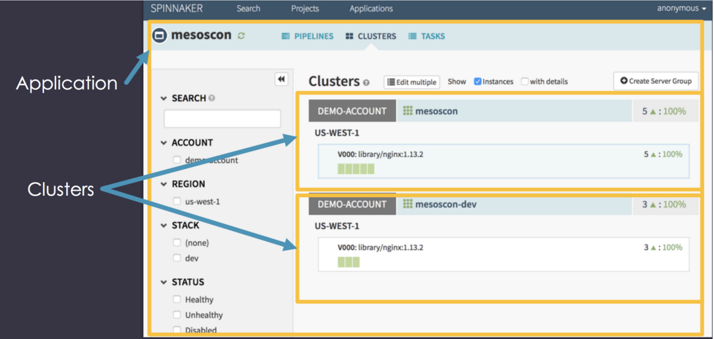

A Spinnaker **cluster** contains **(1-n)** **server groups**, and each **server groups** contains **(0-n)** **service instances**. Each server group representing a new version of the cluster.

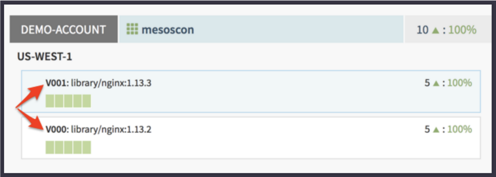

A Spinnaker **server group** maps (1-1) to a DC/OS **service** (aka marathon app).

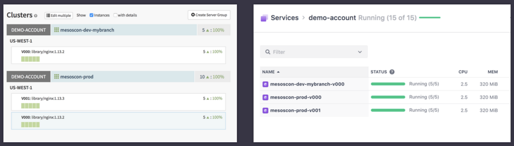

## Users Guide

* [Creating an Application](#creating-an-application)
* [Creating a Server Group](#creating-a-server-group)
* [Creating a Server Group Version](#creating-a-new-server-group-version)

### Creating an Application

On the Spinnaker home page select the *Applications* tab. There you select the *Create Application* action.

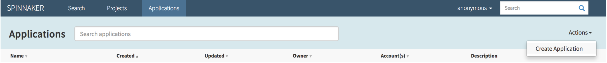

In the *New Application* dialog type *myapp* for the name and *xxx@yyy.zzz* for the owner email.

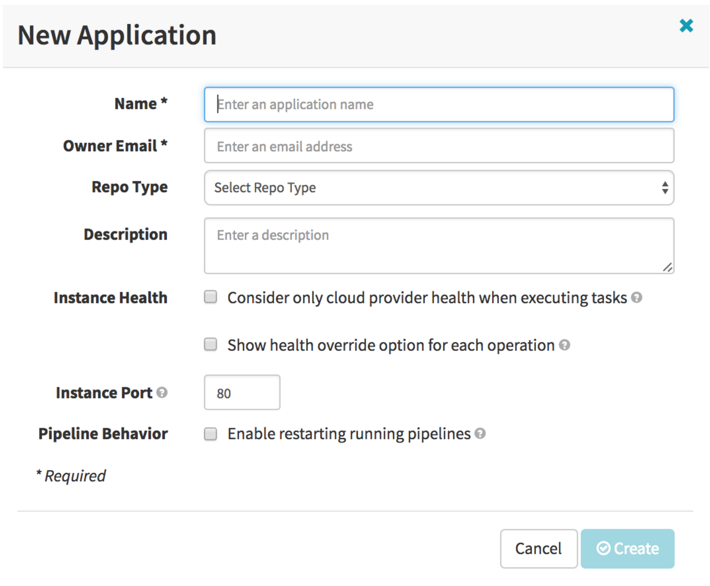

The new *myapp* shows up in the applications list. Select *myapp* to open the app and get ready for the next steps.

### Creating a Server Group

In the *myapp* *Clusters* view select *Create Server Group*. 

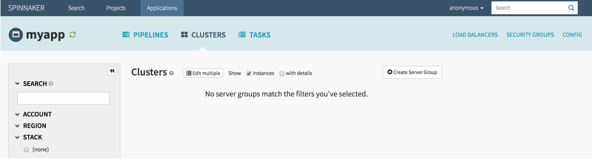

As we learned in the concepts section a server group is a DC/OS service (or marathon app), so most of the things you have to fill in the following are the things you familiar with from creating marathon json defitions.

First selecte the *dcos Account* and *dcos Region* you want to create the server group in. Next select the name of the *Stack*. The Spinnaker application name plus stack name make the cluster name, in our case *myapp-prod*

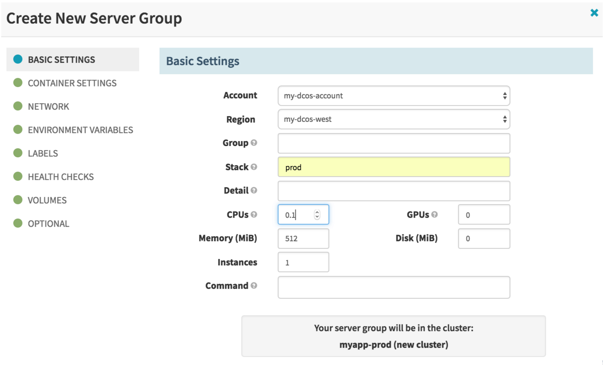

In *Container Settings* selecte *nginx:1.11* for the image to use.

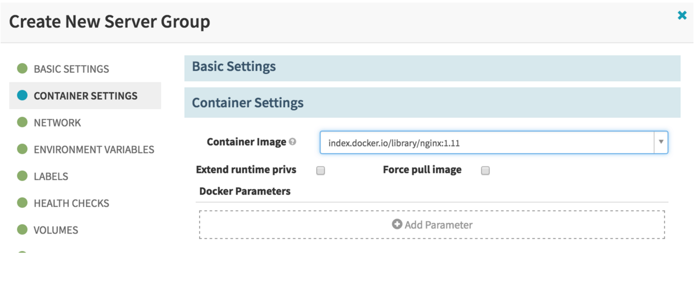

In *Network* selecte *Bridge* for *Network Type* and port *80* for *Container Port*. Also set *web* for service endpoint *Name*. 

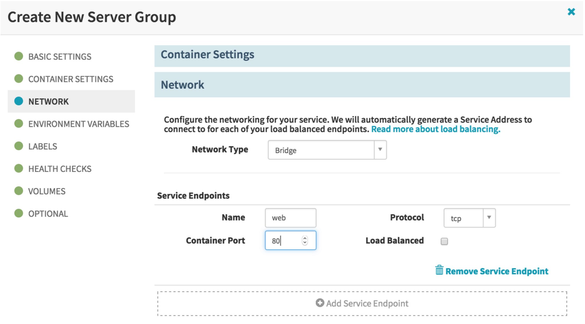

In *Health Checks* define a simple health check specifying */* for *Path* and *0* for *Port Index*. After that hit *Create* to create the server group.

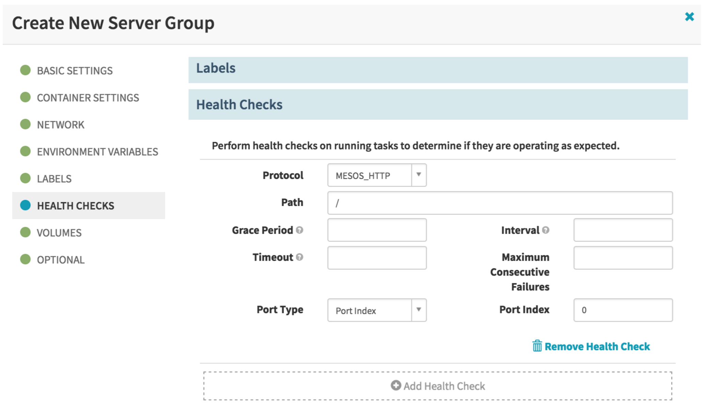

In the *myapp* *Clusters* view you will see the new cluster with one server group containing one instance, i.e. one nginx server running in our sample.

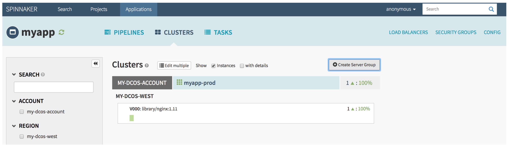

### Creating a Server Group Version

In this section we go through *Create Server Group* a second time. Choose same *dcos Account*, same *dcos Region*, and same name for *Stack* as before.

In *Container Settings* select *nginx:1.12* for the image. For the other sections do the same settings we used the 1st time arround, and hit *Create* to create a new version of the server group.

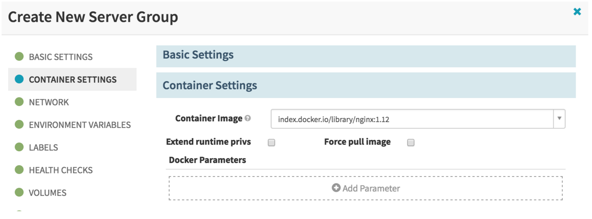

The *myapp* *Clusters* view now shows that our cluster runs two server group versions *V000* and *V001*. Later we show how you can leverage this capability in blue green deployments.

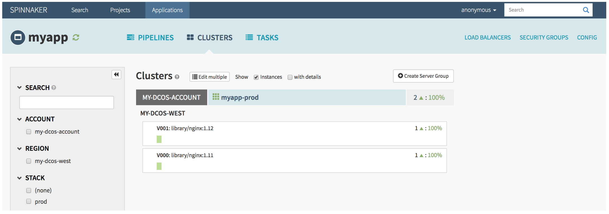

The following shows how our two server group versions look on the DC/OS side. They are DC/OS services with the name made up from cluster name and version number, in this sample *myapp-prod-V000* and *myapp-prod-v001*.

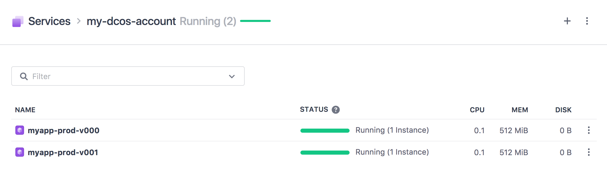
