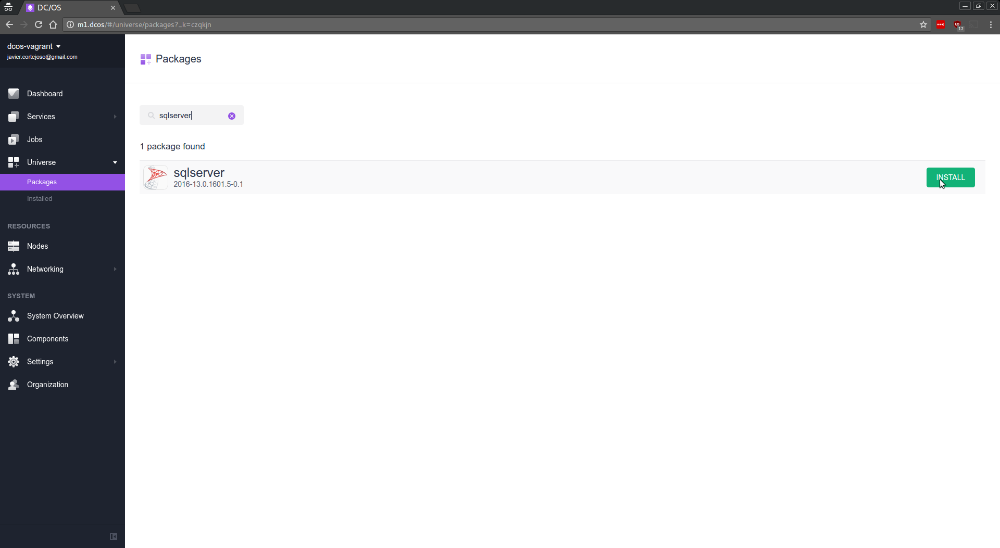

 

***NOTE: This is a community-contributed packaged. This package and tutorial are not maintained or supported by Microsoft***

For official documentation on Microsoft SQL Server, please refer to the [official product documentation](https://docs.microsoft.com/en-us/sql/linux/)

Microsoft SQL Server is a relational database management system developed by Microsoft. As a database server, it is a software product with the primary function of storing and retrieving data as requested by other software applications—which may run either on the same computer or on another computer across a network (including the Internet).

Microsoft SQL Server 2016 delivers breakthrough in-memory performance, unparalleled security, end-to-end mobile BI and advanced analytics.

This package installs an instance of Microsoft SQL Service and makes it available for use by any other applications running in the cluster at the virtual address ***sqlserver.marathon.l4lb.thisdcos.directory*** on port 1433, where "sqlserver" and "1433" are the values for service name and port number respectively.

Optionally, access to the database can be also enabled to applications external to the DC/OS cluster through the use of Marathon-LB, by checking the box "external_access" available in the "networking" section of the "Advanced Install" menu.


- Estimated time for completion: 15 minutes
- Target audience: Anyone who wants to deploy Microsoft SQL Server on DC/OS.
- This package requires a beginner DC/OS skill set.

**Scope**:
 - Configure and launch the SQL server package.
 - Install the SQL Server command-line tools and test your SQL server on DC/OS installation.

**Table of Contents**:

- [Prerequisites](#prerequisites)
- [Install SQL server](#install-sql-server)
  - [Validate installation](#validate-installation)
- [Install SQL command-line tools](#install-sql-command-line-tools)
- [Test SQL server with SQL command-line tools](#test-sql-server-with-sql-command-line-tools)
- [Uninstall](#uninstall)

# Prerequisites

- A running DC/OS v1.9 cluster with at least 1 private agent with at least 4GB of RAM and 1vCPU available.
- Optionally, if external access wants to be enabled, Marathon-LB MUST be running in the cluster.

# Install SQL server

## Install SQL server from the DC/OS GUI

Log into DC/OS, go to Universe, and select the `sqlserver` package from Universe. Simply click `Install` to accept the default installation parameters, or optionally Select `Advanced Installation` to configure the following parameters.




Some interesting parameters that can be configured:

- `service / *name*`: Unique name to identify this specific SQL server instance.

- `service / *sa_password*`: The system administrator (userid = 'sa') password used to connect to SQL Server once the container is running. DEFAULT VALUE: 'YourStrong!Passw0rd'.

- `storage / *persistence*`: create local persistent volumes for internal storage files to survive across restarts or failures.

- `storage / persistence / *external*`: create external persistent volumes. This allows to use an external storage system such as Amazon EBS, OpenStack Cinder, EMC Isilon, EMC ScaleIO, EMC XtremIO, EMC VMAX and Google Compute Engine persistent storage.

*NOTE*: To use external volumes with DC/OS, you MUST enable them during CLI or Advanced installation.

- `storage / *host_volume*`:  if persistence is not selected, this package can use a local volume in the host for storage, like a local directory or an NFS mount. The parameter *host_volume* controls the path in the host in which these volumes will be created, which MUST be the same on all nodes of the cluster.

*NOTE*: If you didn't select persistence in the storage section, or provided a valid value for *host_volume* on installation, YOUR DATA WILL NOT BE SAVED IN ANY WAY.

- `networking / *port*`: This controls the port in which the service is available. Defaults to 1433.

- `networking / *host_mode*`: Enable or disable "host mode" networking. If enabled, the SQL server shares the networking namespace of the host it runs on. This can increase performance. It also requires that the port selected is available in that host.

- `networking / *external_access*`: Create an entry in Marathon-LB for accessing the service from outside of the cluster.

- `networking / *external_access_port*`: port to be used in Marathon-LB for accessing the service from outside the cluster.

Once the package is configured according to your installation and needs, click on "Review and Install", and finally on "Install".


## Install SQL server rom the DC/OS CLI

Alternatively SQL server package can be installed from DC/OS CLI.
Log into a terminal where the DC/OS CLI is installed and has connectivity with the cluster. Install the package from the DC/OS CLI with the default values.

```bash
dcos package install --yes sqlserver
```

The default SA password is 'YourStrong!Passw0rd'.

If you want to modify any of the default installation values, create and save a `sqlserver-options.json` file:

```json
{
  "service": {
    "name": "sqlserver",
    "cpus": 1,
    "mem": 4096,
    "sa_password": "YourStrong!Passw0rd"
  },
  "storage": {
    "host_volume": "/tmp",
    "persistence": {
      "enable": false,
      "volume_size": 1024,
      "external": {
        "enable": false,
        "volume_name": "sqlserver",
        "provider": "dvdi",
        "driver": "rexray"
      }
    }
  },
  "networking": {
    "port": 1433,
    "host_mode": false,
    "external_access": {
      "enable": false,
      "external_access_port": 11433
    }
  }
}
```

Then launch the SQL server DC/OS package with:

```bash
dcos package install --yes --options ./sqlserver-options.json sqlserver
```


## Validate installation

### Validate from GUI

After installation, the package will be running under the `Services` tab:


You can check the package instance’s correct functioning by clicking on the package name and looking at the task’s logs:


### Validate from CLI

After installation, you can check the correct functioning with:

```bash
dcos package list|grep sqlserver
sqlserver            2016-13.0.1601.5-0.1  /sqlserver    ---                  Microsoft SQL Server is a relational database management system developed by Microsoft. As a database server, it is a software product with the primary function of storing and retrieving data as requested by other software applications—which may run either on the same computer or on another computer across a network (including the Internet).

dcos marathon app list|grep sqlserver
/sqlserver    4096   1     1/1    1/1       ---        DOCKER   None
```

# Install SQL command-line tools

Once the SQL server package has been installed in your DC/OS cluster, you can install and use the Microsoft SQL tools to test access control and functioning of your SQL server. To leverage the Virtual IP feature provided by DC/OS, you can execute these commands from any node of your cluster (master, agent, or public agent). In CentOS 7 nodes, this can be achieved with:

```bash
sudo tee /etc/yum.repos.d/msprod.repo  <<-EOF
[packages-microsoft-com-prod]
name=packages-microsoft-com-prod
baseurl=https://packages.microsoft.com/rhel/7/prod/
enabled=1
gpgcheck=1
gpgkey=https://packages.microsoft.com/keys/microsoft.asc
EOF
sudo yum -y install mssql-tools
```

Alternatively, you can dowload the Docker image [mssql-tools](https://hub.docker.com/r/tsgkadot/mssql-tools/) and run the commands from there:

```bash
docker run -it --rm tsgkadot/mssql-tools
```

# Test SQL server with SQL command-line tools

Once Microsoft SQL tools are installed, connectivity and functioning tests can be achieved. A full set of tests is available in the official [Microsoft Documentation](https://docs.microsoft.com/en-us/sql/linux/sql-server-linux-connect-and-query-sqlcmd). Here's a subset to test basic functioning:

*NOTE*: To be able to resolve sqlserver.marathon.l4lb.thisdcos.directory you must be inside any machine of your DC/OS Cluster.

```bash
sqlcmd -S sqlserver.marathon.l4lb.thisdcos.directory -U SA -P 'YourStrong!Passw0rd'
```
```sql
1> SELECT Name from sys.Databases;
2> GO
Name
--------------------------------------------------------------------------------------------------------------------------------
master
tempdb
model
msdb

(4 rows affected)
1> CREATE DATABASE testdb;
2> GO
1> USE testdb;
2> GO
Changed database context to 'testdb'.
1> CREATE TABLE inventory (id INT, name NVARCHAR(50), quantity INT);
2> GO
1> INSERT INTO inventory VALUES (1, 'banana', 150);
2> INSERT INTO inventory VALUES (2, 'orange', 154);
3> GO

(1 rows affected)

(1 rows affected)
1> SELECT * FROM inventory WHERE quantity > 152;
2> GO
id          name                                               quantity
----------- -------------------------------------------------- -----------
          2 orange                                                     154

(1 rows affected)
1> QUIT
```
# Uninstall

To uninstall SQL server:

```bash
$ dcos package uninstall sqlserver
```

## Further resources

1. [Microsoft SQL Server homepage](https://www.microsoft.com/en-us/sql-server/sql-server-2016)
2. [Microsoft SQL Server on linux homepage](https://www.microsoft.com/en-us/sql-server/sql-server-vnext-including-Linux)
