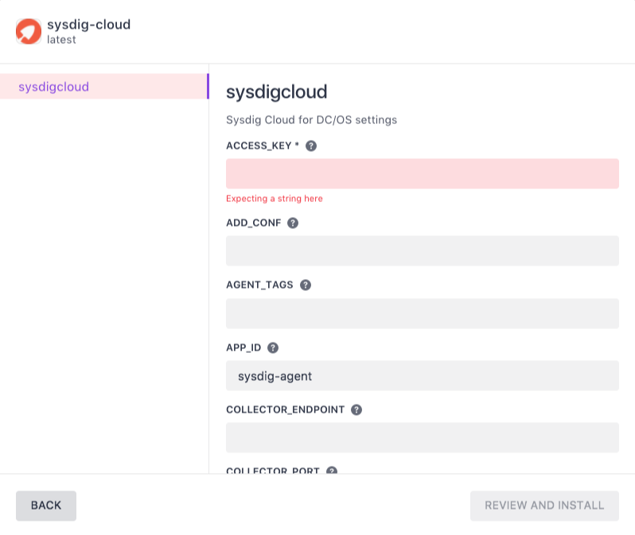
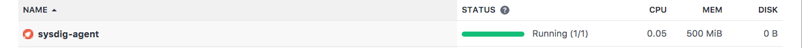

# How to use Sysdig Monitor on DC/OS

[Sysdig Monitor](https://sysdig.com/product/monitor/) is the first and only monitoring, alerting, and troubleshooting solution designed from the ground up to provide unprecedented visibility into containerized infrastructures.

DC/OS allows you to quickly deploy Sysdig Agents to an existing infrastructure.

- Estimated time for completion: 10 minutes
- Target audience: Anyone interested in monitoring containers.
- Scope: Deploy Sysdig Agents on DC/OS and monitor them with Sysdig Monitor.

## Prerequisites

- A Sysdig Cloud account.

## Deploy Sysdig Cloud

1. In a browser, navigate to [https://app.sysdigcloud.com](https://app.sysdigcloud.com).
2. Log into Sysdig Monitor.
3. In the top right-hand corner, open the User dropdown menu, and select `Settings`.
4. Navigate to `Agent Installation` in the left-hand panel.
> If Agent Installation is not listed, disable the `Hide Agent Install` switch on the main `Settings` page.
5. Click the `Copy` button next to the access key.
6. Navigate to the DC/OS admin page.
7. Open the `Universe` dropdown menu on the left hand panel of the DC/OS admin page, and select `Packages`.
8. Use the search function to find and select `sysdig-cloud`.
9. Click the `Install` button.
10. Click the `Advanced Installation` link.

11. Paste the access key in the `ACCESS_KEY` text box.
12. Define the number of instances required.
13. Once the package has been configured, click the `Review and Install` button to review the changes.
14. If the configuration is correct, click the `Install` button to complete the installation.

## Next Steps

1. Open the `Services` dropdown menu on the left-hand panel of the DC/OS admin page, and click `Services`. `sysdig-agent` will now be listed. Click `sysdig-agent` to review the list of running agents.

2. Navigate to [https://app.sysdigcloud.com](https://app.sysdigcloud.com). The instances will now be listed on the `Explore` tab.
