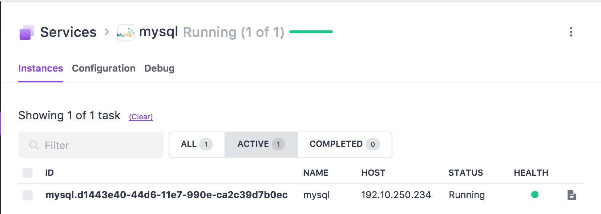

How to use Tadpole DB Hub on DC/OS
==================================

# Prerequisites
* A running DC/OS 1.9 cluster with a total of 1 CPU and 2 GB of RAM available within the cluster.
* Marathon-LB Universe package installed for `virtual-hostname` feature.

# Install and setup Tadpole DB Hub
To install Tadpole DB Hub, navigate to Universe from the DC/OS UI and select Tadpole DB Hub. Advanced Installation should be used and your chosen address should be entered in to the `virtual-host` configuration field.

* In the `networking` tab, the `virtual-host` can be used for external access.
* In the `storage` tab, Persistent storage can be enabled with checkbox. If enabled, `volume-size` and `pinned-hostname` is required.

After the instance is deployed, Tadpole DB Hub Web UI is working on the endpoint. The setup step is followed through the Web UI.

* Term and Conditions:

* Select Individual or Group:

After the setup, main ui is shown on the endpoint:

# How to using Tadpole DB Hub
For using Tadpole DB Hub, a database instance is needed. Tadpole DB Hub supports various databases like MySQL, Postgresql, etc. In this example, MySQL in the Universe will be installed for testing.

## Install MySQL for test.
Install MySQL from the Universe using `Advanced Installation`.

* In the `database` tab, check `USERNAME` and `PASSWORD` has correct value. In this example, `USERNAME` is `admin` and `PASSWORD` is `admin` like this:

* In the `networking` tab, check the `HOST_MODE` so DB can be accessed by `HOST` IP address and `3306` port:

* Verify host IP on MySQL instance. In this example, host IP is `192.10.250.234`:

## Connect to New MySQL using Tadpole DB Hub
For using DB with Tadpole DB Hub, the first step is add database to Tadpole DB Hub.

* Click `Add database` icon of left top, below menu line. The add DB UI is opened like:

 * Fill `Display Name`, `Host`, `Database`, `User` and `Password`.
* Click `Connection Test` to test DB connection. If successful, UI open like this:
 
* Click `OK` and Click `Add DB and Exit`. The added DB is visible on the `Database List` UI:

Test DB is successfully added to Tadpole DB Hub. Now we can test a query to added DB.

## Execute query on Tadpole DB Hub
To compose queries, the `Query Editor` is used for. Click `Open Query Editor` icon on the icon menu.

* `Query Editor` is look like this:

* Compose sample `CREATE Table` query like below:

* Click `Execute` icon to execute query or input shortcut key. After query is executed, the result is on the UI:

 * Table `Persons` is added to database and `Obejct Explorer` of the mid-left shows `Persons` table has no comment and is `InnoDB` type table.

That's it! Add your own databases and users for more exciting usage of Tadpole DB Hub!

# Notes
* If you do not configure persistent storage, data for Tadpole DB Hub is not safe, DB list, Tadpole user account, and other data will be lost when container is failed.
* Tadpole DB Hub package is based on open source(LGPL) version of the software. If you interest on enterprise version, please contact to hangum@tadpolehub.com.

# Resources
* Tadpole DB Hub on GitHub: https://github.com/hangum/TadpoleForDBTools
