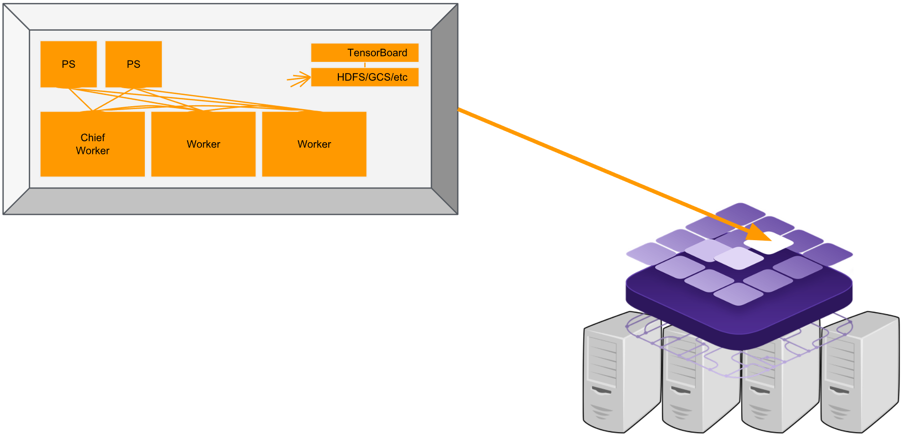

# How to use Tensorflow on DC/OS

NOTE: This is a beta-package which is under development and not officially supported!
It is currently under development and the workflow will change in future releases.


[TensorFlow](https://www.tensorflow.org/) is an open-source software library for Machine Intelligence which is extremely powerful especially in a distributed setting. This framework aims to help
manage the complexity of distributed training by leveraging the capabilities of DC/OS. It automates tedious and
error-prone steps like task deployment, ClusterSpec configuration, task monitoring, failure recovery, etc.


- Estimated time for completion: 10 minutes
- Target audience: Anyone who wants to deploy a distributed Tensorflow on DC/OS. Beginner level.
- Scope: Covers the basics in order to get you started with Tensorflow on DC/OS.



## Prerequisites

- A running DC/OS 1.10 cluster with at least 3 nodes having 6CPU, 12GB of memory in total. This exact amount depends on your configuration for the gpuworker, worker, and ps tasks.
- [DC/OS CLI](https://dcos.io/docs/1.10/usage/cli/install/) installed.
- If you want to benefit from GPU acceleration, please check how to [install DC/OS on GPU instances](https://dcos.io/docs/1.10/deploying-services/gpu/#installing-dc-os-with-gpus-enabled)
- Check the [tools repository](https://github.com/dcos-labs/dcos-tensorflow-tools), also including the examples.

## Install Tensor

1. install TensorFlow cluster with the following command from the DC/OS CLI from within `dcos-tensorflow-tools`:

	```
	dcos package install tensorflow --options=examples/mnist.json
	```

1. The service will now deploy with an [example configuration](https://github.com/dcos-labs/dcos-tensorflow-tools/blob/master/examples/mnist.json). You can monitor its deployment from the Services tab of the DC/OS web interface.

<a name="installing-and-customizing"></a>x
# Installing and Customizing

Assuming you want to train your own models, you will need to create your own configuration to pass in when you
run `dcos package install tensorflow --options=...`. The possible configurations are documented in the [example section](#examples). For more information about building the
options.json file, see the
[DC/OS documentation](https://dcos.io/docs/1.10/deploying-services/config-universe-service/) for service
configuration access.


## Installation from the DC/OS Web Interface

 You can [install TensorFlow from the DC/OS cataloge. If you install TensorFlow from the web interface, you must install the TensorFlow DC/OS CLI subcommands separately. For installing just the DC/OS Tensorflow CLI, enter:

 ```bash
 dcos package install TensorFlow --cli
 ```

 Choose `ADVANCED INSTALLATION` to perform a custom installation.

<a name="service-settings"></a>
## Service Settings

<a name="service-name"></a>
### Service Name

Each instance of TensorFlow in a given DC/OS cluster must be configured with a different service name. You can configure the service name in the **service** section of the advanced installation section of the DC/OS web interface. The default service name (used in many examples here) is _`tensorflow`_.

<a name="job-url"></a>
### Job URL

This URL should point to a Python file or a ZIP containing a Python file. Each gpuworker, worker, and ps task will download
and extract the contents of this URL at runtime.

<a name="job-path"></a>
### Job Path

This path will be appended to the `PYTHON_PATH` in each of your tasks, so that your job can be run from the wrapper script. If
you specified a Job URL which points to a ZIP, your Job Path should be the relative path from the directory in which that ZIP
was extracted to the directory where your main Python file lives. See the [mnist example](https://github.com/dcos-labs/dcos-tensorflow-tools/blob/master/examples/mnist.json) for more details.

<a name="job-name"></a>
### Job Name

This field should match the name of your main Python file (without the path or extension). For example, if your main
Python file lives in `myzip/path/train.py`, your Job Path should be `myzip/path`, and your Job Name should be `train`.

<a name="job-context"></a>
### Job Context

This field should include any runtime settings you want to make available to your main function. Any JSON you paste
here will be available to your main function as a Python dictionary with the `context` argument.

<a name="shared-filesystem"></a>
### Shared Filesystem

The framework works best when you use GCS as a shared filesystem. To use GCS, you will need a bucket and a Service Account with read/write access to that bucket - see "Using Google Cloud Storage" for details. This field should point to that GCS bucket with the following format:

```
gs://<bucket-name>/path/to/folder
```

<a name="tf-images"></a>
### TF Image / GPU TF Image

By default, your TensorFlow jobs will run inside Docker containers based on the official TensorFlow
images (with small additions to support HDFS). If your TensorFlow job has any special requirements,
you can specify a custom image here (pulled from DockerHub).

<a name="task-settings"></a>
## GPU Worker / Worker / Parameter Server Settings

Adjust the following settings to customize the amount of resources allocated to each task.
Your job's resource requirements must be taken into consideration when adjusting these values.
Reducing these values below those requirements may result in adverse performance and/or failures while using the service.

Each of the following settings can be customized under the **gpu_worker**/**worker**/**ps** configuration sections.

<a name="node-count"></a>
### Count

You can choose how many GPU Workers, Workers, and Parameter Servers you want for each TensorFlow job you run.

<a name="cpu"></a>
### CPU

You can customize the amount of CPU allocated to each instance of each type of task.
A value of `1.0` equates to one full CPU core on a machine.
Change this value by editing the **cpus** value. Turning this too low will result in throttled tasks.

<a name="memory"></a>
### Memory

You can customize the amount of RAM allocated to each instance of each type of task.
Change this value by editing the **mem** value (in MB). Turning this too low will result in out of memory errors.

<a name="ports"></a>
### Ports

You can customize the ports exposed by the service via the service configuration.
If you wish to install multiple instances of the service and have them co-locate on the same machines,
you must ensure that **no** ports are common between those instances.
Customizing ports is only needed if you require multiple instances sharing a single machine.
This customization is optional otherwise.
If your pod is on the overlay network (see below) then the port resources will be ignored allowing a pod
to share a machine with another one using the same ports.

You can specify that a pod should join the `dcos` overlay network,
a [Virtual Network](https://docs.mesosphere.com/latest/networking/virtual-networks/#virtual-network-service-dns)
that supports having one IP address per pod.
When a pod joins an overlay network it gets its own IP address and has access to its own array of ports.
Therefore when a pod specifies that it is joining dcos we ignore the ports resource requirements,
because the pod will not consume the ports on the host machine.
The DNS for pods on the overlay network is <task_name>.<framework_name>.autoip.dcos.thisdcos.directory.

**Note** that this DNS will also work for pods on the host network.
**Because the ports resources are not used when a pod is on the overlay network,
we do not allow a pod to be moved from the dcos overlay to the host network or vice-versa.**
This is to prevent potential starvation of the task when the host with the reserved resources for the task does
not have the available ports required to launch the task.

<a name="storage-volumes"></a>
### Storage Volumes

The service supports two volume types:
- `ROOT` volumes are effectively an isolated directory on the root volume, sharing IO/spindles with the rest of the host system.
- `MOUNT` volumes are a dedicated device or partition on a separate volume, with dedicated IO/spindles.

Using `MOUNT` volumes requires [additional configuration on each DC/OS agent system](https://docs.mesosphere.com/1.9/storage/mount-disk-resources/),
so the service currently uses `ROOT` volumes by default. To ensure reliable and consistent performance in a production environment,
you should configure `MOUNT` volumes on the machines that will run the service in your cluster and then configure the following as `MOUNT` volumes:

<a name="placement-constraints"></a>
### Placement Constraints

Placement constraints allow you to customize where the service is deployed in the DC/OS cluster.

Placement constraints support all [Marathon operators](http://mesosphere.github.io/marathon/docs/constraints.html)
with this syntax: `field:OPERATOR[:parameter]`. For example, if the reference lists `[["hostname", "UNIQUE"]]`, use `hostname:UNIQUE`.

A common task is to specify a list of whitelisted systems to deploy to. To achieve this, use the following syntax for the placement constraint:

```
hostname:LIKE:10.0.0.159|10.0.1.202|10.0.3.3
```

You must include spare capacity in this list, so that if one of the whitelisted systems goes down,
there is still enough room to repair your service without that system.

# Examples

The [dcos-tensorflow-tools](https://github.com/dcos-labs/dcos-tensorflow-tools) comes with a number of examples ready to be used.
It also comes with instructions on how to deploy your own examples.


<a name="uninstalling"></a>
# Uninstalling

See the uninstallation documentation [here](../uninstall.md)

<a name="connecting-clients"></a>
# Connecting Clients

One of the benefits of running containerized services is that they can be placed anywhere in the cluster.
Because they can be deployed anywhere on the cluster, clients need a way to find the service. This is where service discovery comes in.

<a name="discovering-endpoints"></a>
## Discovering Endpoints

Once the service is running, you may view information about its endpoints via either of the following methods:
- CLI:
  - List endpoint types: `dcos tensorflow endpoints`
  - View endpoints for an endpoint type: `dcos tensorflow endpoints <endpoint>`
- Web:
  - List endpoint types: `<dcos-url>/service/tensorflow/v1/endpoints`
  - View endpoints for an endpoint type: `<dcos-url>/service/tensorflow/v1/endpoints/<endpoint>`

Returned endpoints will include the following:
- `.autoip.dcos.thisdcos.directory` hostnames for each instance that will follow them if they're moved within the DC/OS cluster.
- A HA-enabled VIP hostname for accessing any of the instances (optional).
- A direct IP address for accesssing the service if `.autoip.dcos.thisdcos.directory` hostnames are not resolvable.
- If your service is on the `dcos` overlay network, then the IP will be from the subnet allocated to the host that the task is running on.
It will not be the host IP. To resolve the host IP use Mesos DNS (`<task>.<service>.mesos`).

In general, the `.autoip.dcos.thisdcos.directory` and `<task>.<service>.mesos` endpoints will only work from within the same DC/OS cluster.
From outside the cluster you can either use the direct IPs or set up a proxy service that acts as a frontend to your TensorFlow instance.
For development and testing purposes, you can use [DC/OS Tunnel](https://docs.mesosphere.com/latest/administration/access-node/tunnel/)
to access services from outside the cluster, but this option is not suitable for production use.

<a name="managing"></a>
# Managing

<a name="updating-configuration"></a>
## Updating Configuration
You can make changes to the service after it has been launched.
Configuration management is handled by the scheduler process, which in turn handles deploying TensorFlow itself.

Edit the runtime environment of the scheduler to make configuration changes.
After making a change, the scheduler will be restarted and automatically deploy any detected changes to the service, one node at a time.
For example, a given change will first be applied to `worker-0`, then `worker-1`, and so on.

Some changes, such as decreasing the number of nodes or changing volume requirements, are not supported after initial deployment.
See [Limitations](#limitations).

To make configuration changes via scheduler environment updates, perform the following steps:
1. Visit <dcos-url> to access the DC/OS web interface.
1. Navigate to `Services` and click on the service to be configured (default _`tensorflow`_).
1. Click `Edit` in the upper right. On DC/OS 1.9.x, the `Edit` button is in a menu made up of three dots.
1. Navigate to `Environment` (or `Environment variables`) and search for the option to be updated.
1. Update the option value and click `Review and run` (or `Deploy changes`).
1. The Scheduler process will be restarted with the new configuration and will validate any detected changes.
1. If the detected changes pass validation, the relaunched Scheduler will deploy the changes by sequentially relaunching affected tasks as described above.

To see a full listing of available options, run `dcos package describe --config tensorflow` in the CLI,
or browse the TensorFlow install dialog in the DC/OS web interface.

<a name="adding-a-node"></a>
### Adding more tasks
You can customize this value at initial deployment or after the cluster is already running. Shrinking the cluster is not supported.

Modify the `WORKER_COUNT`, `GPU_WORKER_COUNT`, and `PARAMETER_SERVER_COUNT` environment variables to update the task counts.
If you decrease this value, the scheduler will prevent the configuration change until it is reverted back to its original value or larger.

Please note that without a shared filesystem (GCS/HDFS/etc.), your Job will not be able to handle this update.

<a name="resizing-a-node"></a>
### Resizing a Node
The CPU and Memory requirements of each node can be increased or decreased as follows:
- CPU (1.0 = 1 core): `WORKER_CPUS`, `GPU_WORKER_CPUS`, `PARAMETER_SERVER_CPUS`
- Memory (in MB): `WORKER_MEM`, `GPU_WORKER_MEM`, `PARAMETER_SERVER_MEM`

**Note:** Volume requirements (type and/or size) cannot be changed after initial deployment.

<a name="updating-placement-constraints"></a>
### Updating Placement Constraints

Placement constraints can be updated after initial deployment using the following procedure.
See [Service Settings](#service-settings) above for more information on placement constraints.

Let's say we have the following deployment of our nodes

- Placement constraint of: `hostname:LIKE:10.0.10.3|10.0.10.8|10.0.10.26|10.0.10.28|10.0.10.84`
- Tasks:
```
10.0.10.3: worker-0
10.0.10.8: worker-1
10.0.10.26: worker-2
10.0.10.28: empty
10.0.10.84: empty
```

`10.0.10.8` is being decommissioned and we should move away from it. Steps:

1. Remove the decommissioned IP and add a new IP to the placement rule whitelist by editing `NODE_PLACEMENT`:

	```
	hostname:LIKE:10.0.10.3|10.0.10.26|10.0.10.28|10.0.10.84|10.0.10.123
	```
1. Redeploy `worker-1` from the decommissioned node to somewhere within the new whitelist: `dcos tensorflow pods replace worker-1`
1. Wait for `worker-1` to be up and healthy before continuing with any other replacement operations.

<a name="restarting-a-node"></a>
## Restarting a Node

This operation will restart a node while keeping it at its current location and with its current persistent volume data.
This may be thought of as similar to restarting a system process, but it also deletes any data that is not on a persistent volume.

1. Run `dcos tensorflow pods restart worker-<NUM>`, e.g. `worker-2`.

<a name="replacing-a-node"></a>
## Replacing a Node

This operation will move a node to a new system and will discard the persistent volumes at the prior system to be rebuilt at the new system.
Perform this operation if a given system is about to be offlined or has already been offlined.

**Note:** Nodes are not moved automatically. You must perform the following steps manually to move nodes to new systems.
You can build your own automation to perform node replacement automatically according to your own preferences.

1. Run `dcos tensorflow pods replace worker-<NUM>` to halt the current instance (if still running) and launch a new instance elsewhere.

For example, let's say `worker-3`'s host system has died and `worker-3` needs to be moved.

1. Start `worker-3` at a new location in the cluster.
	``` shell
	$ dcos tensorflow pods replace worker-3
	```

<a name="disaster-recovery"></a>
# Disaster Recovery

If you use a shared filesystem like GCS, it will be available to your main function as `log_dir`. If you write all of your
checkpoint files to `log_dir`, Disaster Recovery will be a breeze! Your tasks will automatically be restarted when they fail,
they will all have access to the latest checkpoint file, and they will easily resume training from the latest checkpoint.

<a name="accessing-logs"></a>
## Accessing Logs

Logs for the scheduler and all service nodes can be viewed from the DC/OS web interface.

- Scheduler logs are useful for determining why a node isn't being launched (this is under the purview of the Scheduler).
- Node logs are useful for examining problems in the service itself.

In all cases, logs are generally piped to files named `stdout` and/or `stderr`.

To view logs for a given node, perform the following steps:
1. Visit <dcos-url> to access the DC/OS web interface.
1. Navigate to `Services` and click on the service to be examined (default _`tensorflow`_).
1. In the list of tasks for the service, click on the task to be examined (scheduler is named after the service, nodes are each `worker-#-node`).
1. In the task details, click on the `Logs` tab to go into the log viewer. By default, you will see `stdout`, but `stderr` is also useful.
Use the pull-down in the upper right to select the file to be examined.

You can also access the logs via the Mesos UI:
1. Visit <dcos-url>/mesos to view the Mesos UI.
1. Click the `Frameworks` tab in the upper left to get a list of services running in the cluster.
1. Navigate into the correct framework for your needs. The scheduler runs under `marathon` with a task name matching the service name (default _`tensorflow`_).
Service nodes run under a framework whose name matches the service name (default _`tensorflow`_).
1. You should now see two lists of tasks. `Active Tasks` are tasks currently running, and `Completed Tasks` are tasks that have exited.
Click the `Sandbox` link for the task you wish to examine.
1. The `Sandbox` view will list files named `stdout` and `stderr`. Click the file names to view the files in the browser,
or click `Download` to download them to your system for local examination.
Note that very old tasks will have their Sandbox automatically deleted to limit disk space usage.


### Support and bug reports

The DC/OS Tensorflow package is currently community supported. If you get
stuck, need help or have questions, just ask via one of the following channels:

- [Slack](http://chat.dcos.com)
- [Google Group](https://groups.google.com/forum/#!forum/dcos-tensorflow)
