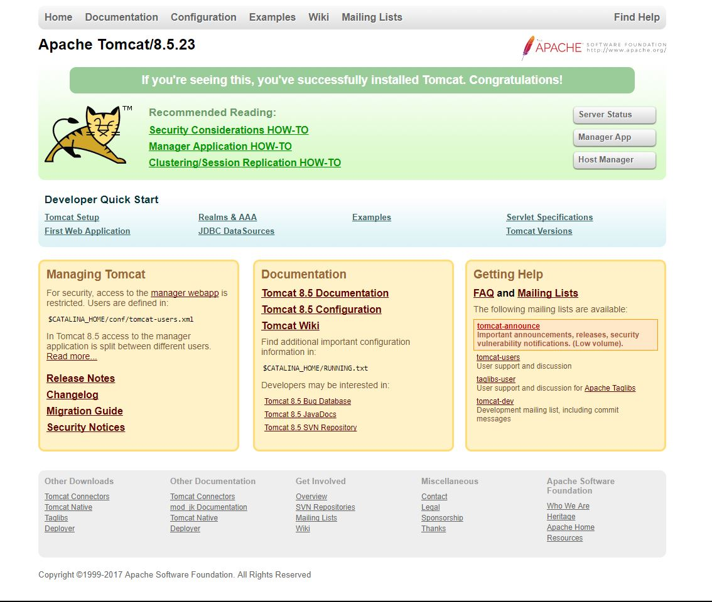
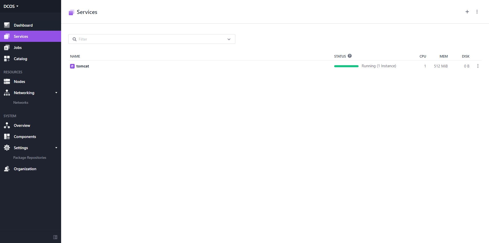
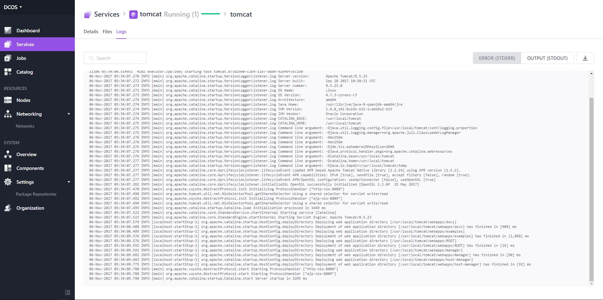

# How to use Tomcat on DC/OS

[Apache Tomcat](http://tomcat.apache.org/) provides implementations of Servlet, JSP, EL and WebSocket from the Java EE Web Application Container specification.

- Estimated time for completion: 10 minutes
- Target audience: Anyone interested in using a Java app server.
- Scope: Learn to install and run Tomcat.

**Table of Contents**:

- [Prerequisites](#prerequisites)
- [Launch Tomcat](#launch-tomcat)
- [Access Tomcat](#access-tomcat)
- [Shut down Tomcat](#shut-down-tomcat)

## Prerequisites

- A running DC/OS 1.10 cluster with at least 1 [public agent](https://dcos.io/docs/1.10/overview/concepts/#public-agent-node) node.
- [DC/OS CLI](https://dcos.io/docs/1.10/usage/cli/install/) installed.
- [jq](https://github.com/stedolan/jq/wiki/Installation) installed.
- [SSH](https://dcos.io/docs/1.10/administration/access-node/sshcluster/) configured.

## Launch Tomcat

Download the provided Marathon app spec for Tomcat, `tomcat.json`, to your local machine where the DC/OS CLI is installed:

```
$ curl -O https://raw.githubusercontent.com/dcos/examples/master/tomcat/1.10/tomcat.json
```

Lets inspect the `tomcat.json` file:

```json
{
  "id": "/tomcat",
  "instances": 1,
  "cpus": 1,
  "mem": 512,
  "container": {
    "type": "DOCKER",
    "docker": {
      "image": "tomcat:8.5",
      "network": "BRIDGE",
      "portMappings": [
        {
          "protocol": "tcp",
          "hostPort": 80,
          "containerPort": 8080
        }
      ]
    }
  },
  "requirePorts": true,
  "acceptedResourceRoles": [
    "slave_public"
  ],
  "env": {
    "JAVA_OPTS": "-Xms256m -Xmx256m"
  },
  "healthChecks": [
    {
      "gracePeriodSeconds": 120,
      "intervalSeconds": 30,
      "maxConsecutiveFailures": 3,
      "path": "/",
      "portIndex": 0,
      "protocol": "HTTP",
      "timeoutSeconds": 5
    }
  ]
}
```

Here we've defined the app (`.id`) to be `/tomcat`. We want Marathon to run one instance of Tomcat for us on our cluster, each instance will require one cpu share (`.cpus`), 512 MB of RAM (`.mem`) and port `80` (`.container.docker.portMappings[0].hostPort`). We then tell Marathon the container image we want Tomcat to be ran from, in this case we're running `tomcat:8.5` from [DockerHub](https://hub.docker.com/_/tomcat/) (`.container.docker.image`).

We've specified that Marathon should run the Docker image using [Bridge Networking](https://docs.docker.com/engine/userguide/networking/#the-default-bridge-network) (`.container.docker.network`), and specified that TCP port 80 on the host (`.container.docker.portMappings[0].hostPort`) should be forwarded to TCP port `8080` inside the container (`.container.docker.portMappings[0].containerPort`). Further, we tell Marathon that we have to run on port `80` by setting `.requirePorts` to true.

To ensure that we can get to Tomcat on the internet we instruct Marathon to only run Tomcat on a node that has the role `slave_public` (which is the public agent node).

Next we define the `JAVA_OPTS` that Tomcat will start with (`.env.JAVA_OPTS`). Finally we define a health check for Tomcat, Marathon will use this health check to automatically restart our container if Tomcat becomes unhealthy or unresponsive.

Now we can run the service through submitting the above app spec `tomcat.json` to Marathon:

```
$ dcos marathon app add tomcat.json
```

To validate that that Tomcat is running, do the following:

```
$ ​dcos marathon app list
ID       MEM  CPUS  TASKS  HEALTH  DEPLOYMENT  WAITING  CONTAINER  CMD  
/tomcat  512   1     1/1    1/1       ---      False      DOCKER   N/A
```

## Access Tomcat

To access Tomcat, navigate to the public agent, that is, `http://<public_agent_public_ip>` and note that you'll need to [find the IP of the public agent](https://dcos.io/docs/1.10/administration/locate-public-agent/) first, for this to work. 

In this example the public IP address is `192.168.65.60` and when we navigate there, we see something like the following:



### View task logs in DC/OS UI

From the `Services` tab of the DC/OS UI you can click on `tomcat` to see the list of tasks running:



Click on the `Logs` tab to see the following:



### View task logs via DC/OS CLI

Run this command to tail the `stderr` file of Tomcat via the DC/OS CLI:

```
$ ​dcos task log --follow tomcat stderr
06-Nov-2017 05:34:09.576 INFO [localhost-startStop-1] org.apache.catalina.startup.HostConfig.deployDirectory Deployment of web application directory [/usr/local/tomcat/webapps/examples] has finished in [1,088] ms
06-Nov-2017 05:34:09.576 INFO [localhost-startStop-1] org.apache.catalina.startup.HostConfig.deployDirectory Deploying web application directory [/usr/local/tomcat/webapps/ROOT]
06-Nov-2017 05:34:09.592 INFO [localhost-startStop-1] org.apache.catalina.startup.HostConfig.deployDirectory Deployment of web application directory [/usr/local/tomcat/webapps/ROOT] has finished in [16] ms
06-Nov-2017 05:34:09.592 INFO [localhost-startStop-1] org.apache.catalina.startup.HostConfig.deployDirectory Deploying web application directory [/usr/local/tomcat/webapps/manager]
06-Nov-2017 05:34:09.682 INFO [localhost-startStop-1] org.apache.catalina.startup.HostConfig.deployDirectory Deployment of web application directory [/usr/local/tomcat/webapps/manager] has finished in [90] ms
06-Nov-2017 05:34:09.683 INFO [localhost-startStop-1] org.apache.catalina.startup.HostConfig.deployDirectory Deploying web application directory [/usr/local/tomcat/webapps/host-manager]
06-Nov-2017 05:34:09.775 INFO [localhost-startStop-1] org.apache.catalina.startup.HostConfig.deployDirectory Deployment of web application directory [/usr/local/tomcat/webapps/host-manager] has finished in [92] ms
06-Nov-2017 05:34:09.780 INFO [main] org.apache.coyote.AbstractProtocol.start Starting ProtocolHandler ["http-nio-8080"]
06-Nov-2017 05:34:09.788 INFO [main] org.apache.coyote.AbstractProtocol.start Starting ProtocolHandler ["ajp-nio-8009"]
06-Nov-2017 05:34:09.790 INFO [main] org.apache.catalina.startup.Catalina.start Server startup in 2295 ms
```

## Shut down Tomcat

To shut down and remove Tomcat, do:

```
$ dcos marathon app remove /tomcat
```

Note that the log files generated when running Tomcat will be automatically cleaned up by DC/OS.
