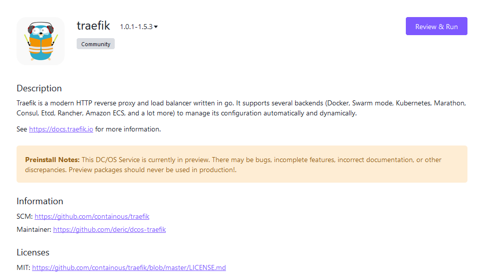
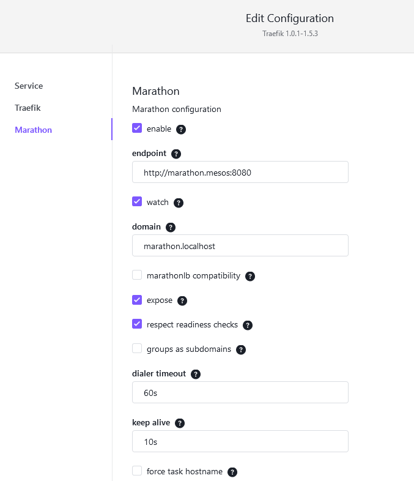
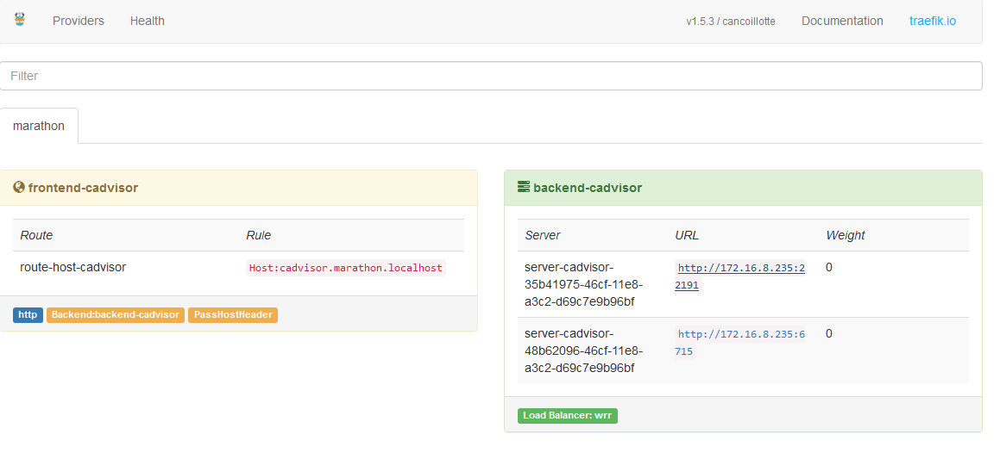

# How to use Traefik on DC/OS

[Traefik](https://traefik.io) is a modern HTTP reverse proxy and load balancer written in Go. It supports several backends (Docker, Swarm mode, Kubernetes, Marathon, Consul, Etcd, Rancher, Amazon ECS, and a lot more) to manage its configuration automatically and dynamically.

- Estimated time for completion: 5 minutes
- Target audience: Anyone interested in exposing service to the Internet or load-balancing internal services from some service discovery backend.
- Scope: Learn how to install Traefik on DC/OS

For more details check out [Traefik documentation](https://docs.traefik.io).

**Table of Contents**:

- [Quickstart](#quickstart)
- [Installation via CLI](#installation-via-cli)
- [Marathon](#marathon)
- [Further Reading](#further-reading)

## Quickstart

Prerequisites:

- A running DC/OS 1.11 cluster with at least 1 [public agent](https://docs.mesosphere.com/1.11/overview/concepts/#public-agent-node) node if you expect to expose your site/API to the public.

Traefik is a load balancer written in Go, that generally doesn't require many resources. But in order to handle large volume of traffic more CPU/Memory might be required.

By default Traefik is configured to run on public DC/OS agents (role: `slave_public`). In order to use Traefik as an internal load-balancer use role: `*` and update ports to higher range (e.g. `10080`,`10443` and `10081` for HTTP, HTTPS and web UI respectively).

Before installing Traefik, there are few options you might want to modify. Hit "EDIT" button



and go to **marathon** section.

Traefik is configured to fetch configuration from DC/OS Marathon. System Marathon running all services in the "Services" tab can be reached via Mesos DNS at `http://marathon.mesos:8080` (default). If you're running another Marathon instance installed from the "Catalog", then use its DNS, e.g. `http://marathon-user.marathon.l4lb.thisdcos.directory:8080`.



* **DOMAIN** by default all tasks will be assigned hostname `{task id}.{domain}`. e.g. `elastic.marathon.localhost`
* **EXPOSE** all services fetched from Marathon will be exposed via default hostname

Review service configuration and hit "Run service", the service should start immediately. Now you can navigate to `{DC/OS master}/service/traefik` to see Traefik dashboard:



On the left side you can see configured frontends and on the right side approprite backends with Mesos task UUID and port. If you haven't enabled **EXPOSE** flag, there's not much to see.

In order to test Traefik, install e.g. `nginx` or any other package that offers web interface. Edit the service configuration and following labels:

```json
"traefik.enable": "true",
"traefik.frontend.rule": "Host:nginx.example.com",
```

and redeploy the service. Now go back to Traefik UI and you should be able to see `frontend-nginx` and `backend-nginx`. If chosen hostname points to your frontend server you should be able to reach the endpoint by entering the address into a web browser.


## Installation via CLI

Prerequisites:

- A running DC/OS 1.11 cluster with at least 1 [public agent](https://docs.mesosphere.com/1.11/overview/concepts/#public-agent-node) if you expect to expose your site/API to the public.
- [DC/OS CLI](https://docs.mesosphere.com/1.11/cli/install/) installed.

```bash
dcos package install traefik
```

or create a `traefik.json` config:
```json
{
  "service": {
    "name": "traefik",
    "cpus": 1.0,
    "mem": 128,
    "instances": 1,
    "user": "root",
    "role": "slave_public",
    "minimumHealthCapacity": 0,
    "maximumOverCapacity": 0.2
  },
  "traefik": {
    "http-port": 80,
    "https-enable": true,
    "https-port": 443,
    "admin-enable": true,
    "admin-port": 8080,
    "config-file": "/etc/traefik/rules.toml",
    "watch-config-file": true
  },
  "marathon": {
    "enable": true,
    "endpoint": "http://marathon.mesos:8080",
    "watch": true,
    "domain": "marathon.localhost",
    "marathonlb-compatibility": false,
    "expose": false,
    "groups-as-subdomains": false,
    "dialer-timeout": "60s",
    "keep-alive": "10s",
    "force-task-hostname": false
  }
}
```

and install `traefik` with customized options:
```
dcos package install --options=traefik.json traefik
```

## Marathon

Marathon labels on each service are used to configure frontends in Traefik. See [the documentation](https://docs.traefik.io/configuration/backends/marathon/#on-containers) for all supported options.

* `traefik.enable`: `true` necessary if you're not exposing all Marathon services
* `traefik.frontend.rule`: `Host:blog.example.com, www.example.com` override the default frontend rule (Default: `Host:{task name}.{domain}`).
* `traefik.portIndex`: `1` useful when application exposes multiple ports (default: `0`)
* `traefik.protocol`: `https` override the default `http` protocol
* `traefik.backend.healthcheck.path`: `/health` very useful in order to avoid downtimes during service deployment and restart
* `traefik.backend.healthcheck.interval`: `5s` interval of health checks
* `traefik.frontend.entryPoints`:`http,https` assign this frontend to entry points
* `traefik.backend.loadbalancer.stickiness`: `true`	enable backend sticky sessions

## Advanced configuration

Each Traefik instance generates its config file in Mesos working directory from supplied ENV variables. You can provide any additional configuration sections by creating a toml config `/etc/traefik/rules.toml`. Location of the file can be specified by defining `TRAEFIK_FILE_NAME` ENV variable.

## Further reading

For more details check out [Traefik documentation](https://docs.traefik.io) or [dcos-traefik](https://github.com/deric/dcos-traefik) packaging to see supported ENV variables.