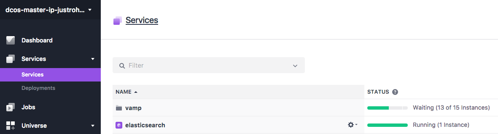
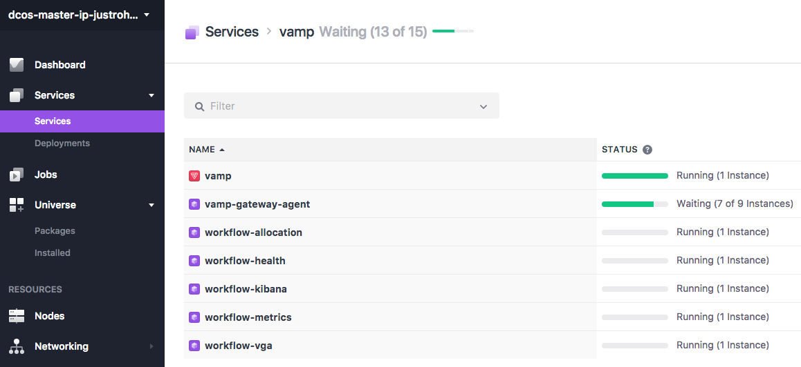
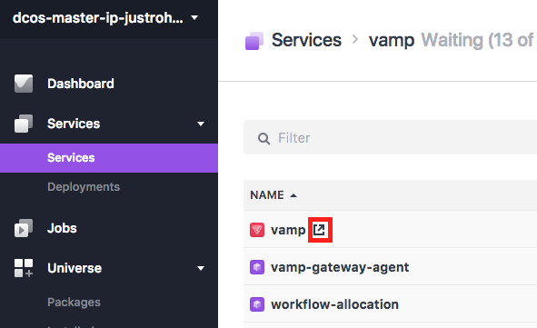
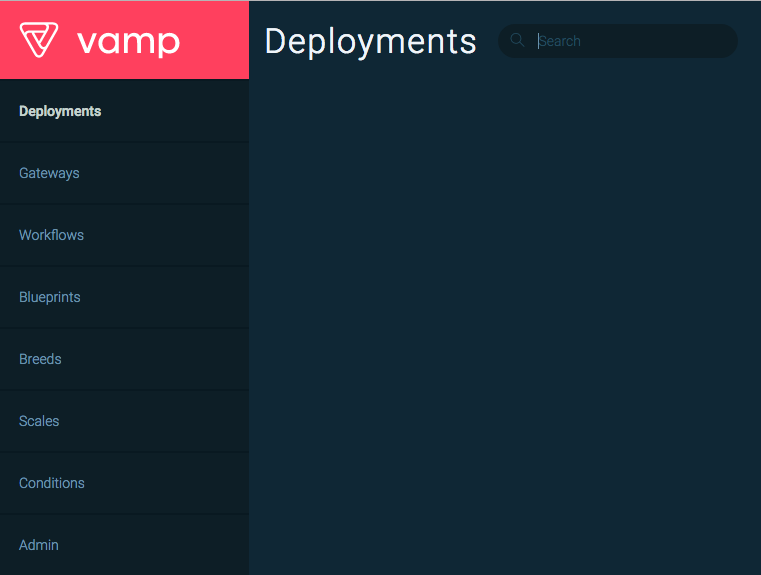
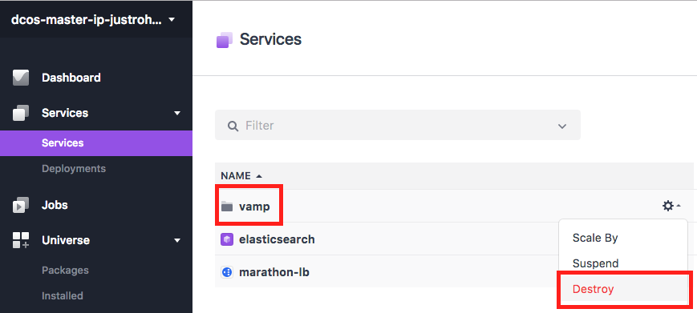
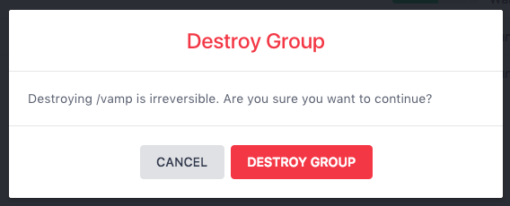

# How to use Vamp on DC/OS 

[Vamp](http://www.vamp.io) is a microservices management platform for doing advanced canary releases and A/B testing.

- Estimated time for completion: 5 minutes
- Target audience: Anyone hosting web applications in microservices
- Scope: Install the DC/OS Vamp service


## Prerequisites

- A running DC/OS 1.9 cluster
- [DC/OS CLI](https://dcos.io/docs/1.9/usage/cli/install/) installed
- Elasticsearch cluster for Vamp to store data in

## Install Elasticsearch

You need Elasticsearch running in order to properly deploy Vamp. For testing purposes you can deploy our own image. For this, create a file called `elasticsearch.json` with this content:

```json
{
  "id": "elasticsearch",
  "instances": 1,
  "cpus": 0.2,
  "mem": 1024.0,
  "container": {
    "docker": {
      "image": "magneticio/elastic:2.2",
      "network": "HOST",
      "forcePullImage": true
    }
  },
  "healthChecks": [
    {
      "protocol": "TCP",
      "gracePeriodSeconds": 30,
      "intervalSeconds": 10,
      "timeoutSeconds": 5,
      "port": 9200,
      "maxConsecutiveFailures": 0
    }
  ]
}
```

Deploy it in your DC/OS cluster:

```bash
$ dcos marathon app add ./elasticsearch.json
```

**Be aware:** This image is not designed for production scale deployments, only for testing and demonstration purposes! 


## Install Vamp

To specify the connection details to Elasticsearch create a file called `vamp-config.json` with the following content:

```json
{
  "service": {
    "elasticsearch-url": "http://elasticsearch.marathon.mesos:9200"
  }
}
```

Then, from the command line run the following:

```bash
$ dcos package install --options=vamp-config.json vamp
This DC/OS Service is currently in preview. In order to run Vamp you need to specify connection parameters to Elasticsearch.
See installation instruction at http://vamp.io/documentation/installation/dcos/

Continue installing? [yes/no] yes
Installing Marathon app for package [vamp] version [0.9.3-0.0.2]
Vamp has been successfully installed!

	Documentation: http://www.vamp.io
	Issues: https://github.com/magneticio/vamp/issues

```

Next, validate that Vamp is successfully installed. Go to the `Services` tab of the DC/OS UI and check if Vamp shows up in the list as `Healthy`:





In addition, run this command to view installed services:

```bash
$ dcos package list
NAME  VERSION      APP         COMMAND  DESCRIPTION                                             
NAME         VERSION      APP           COMMAND  DESCRIPTION
vamp         0.9.3-0.0.2  /vamp/vamp    ---      Canary test/release and autoscaling platform for DC/OS
```

Go to the `Services` tab of the DC/OS UI, click on the `vamp` folder and click on the icon next to the first `vamp`service to open the vamp dashboard





## Uninstall Vamp

To uninstall Vamp enter the following command:

```bash
$ dcos package uninstall vamp
```

Or you can destroy the service from DC/OS Dashboard:





Finally, to get rid of all traces of Vamp in ZooKeeper, follow the steps outlined in the [framework cleaner](https://docs.mesosphere.com/1.9/usage/managing-services/uninstall/#framework-cleaner).

## Further reading

For more information about Vamp check out our website at [www.vamp.io](http://www.vamp.io) where we have [tutorials](http://vamp.io/documentation/tutorials/) you can follow, or just read through the [documentation](http://vamp.io/documentation/how-vamp-works/architecture-and-components/).
