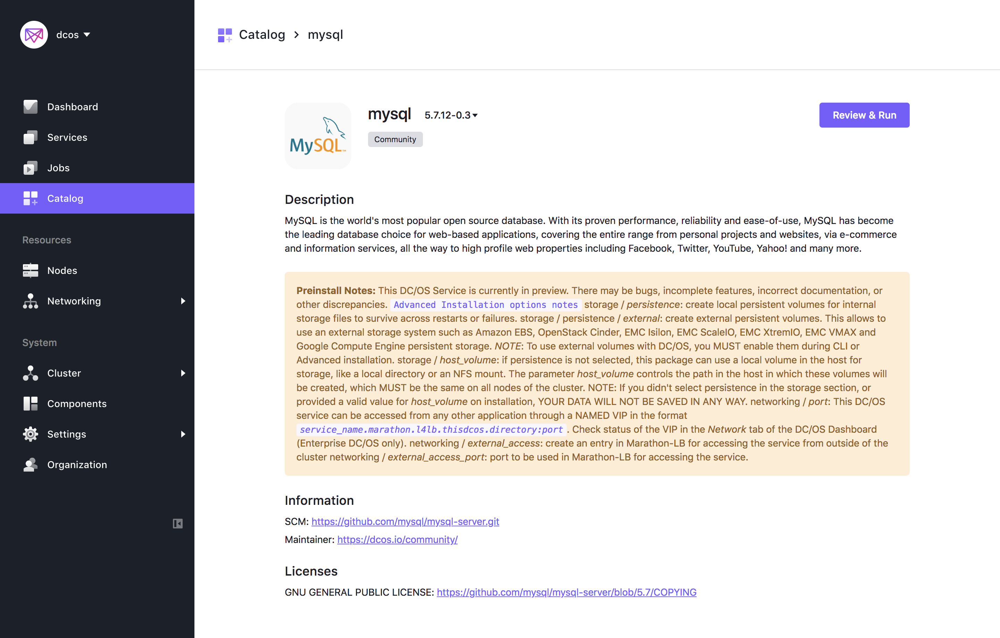
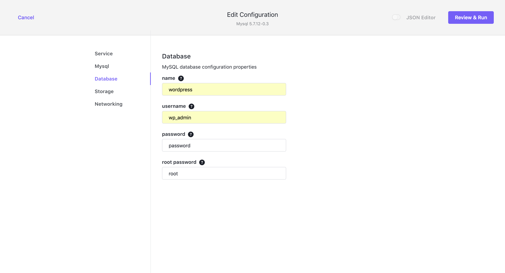
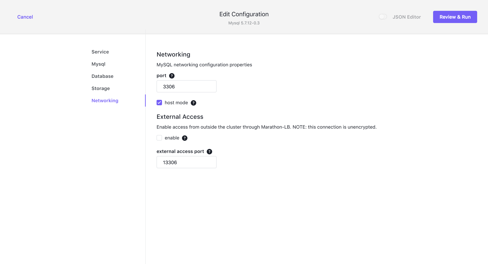
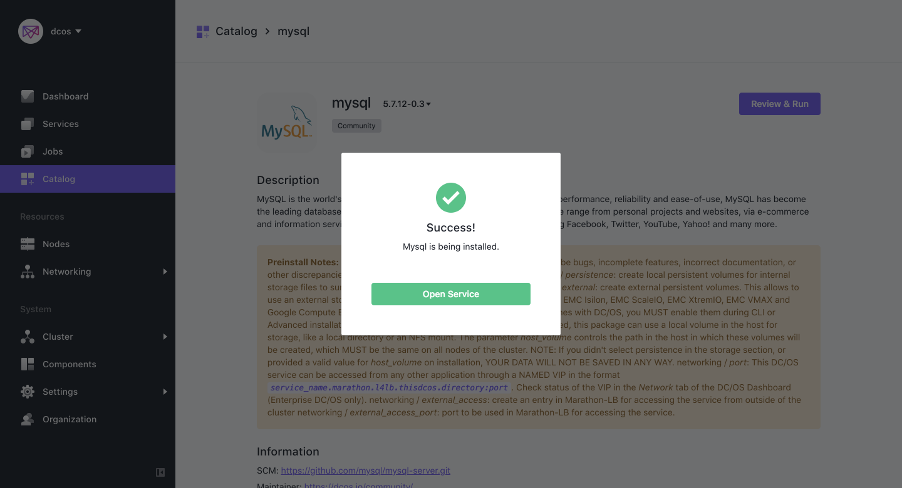
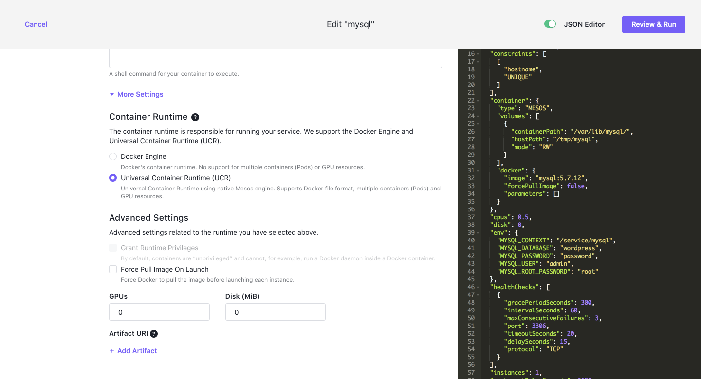
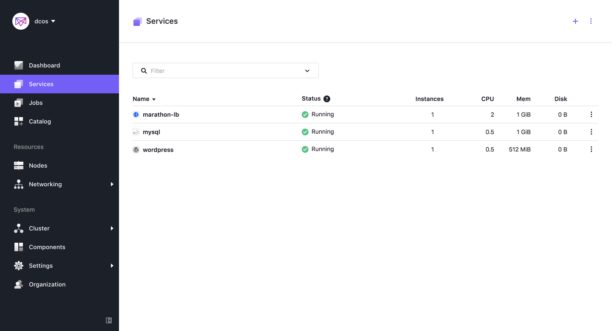
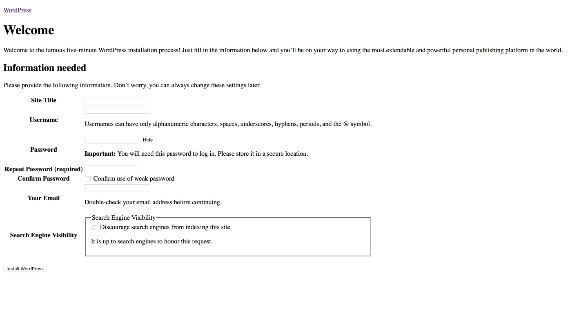
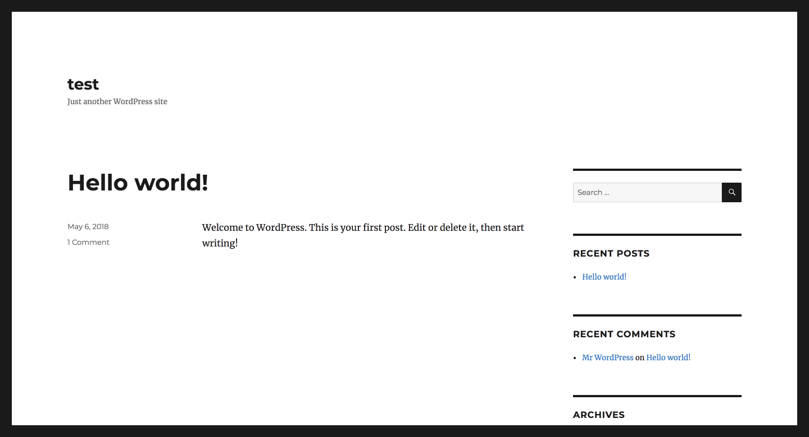
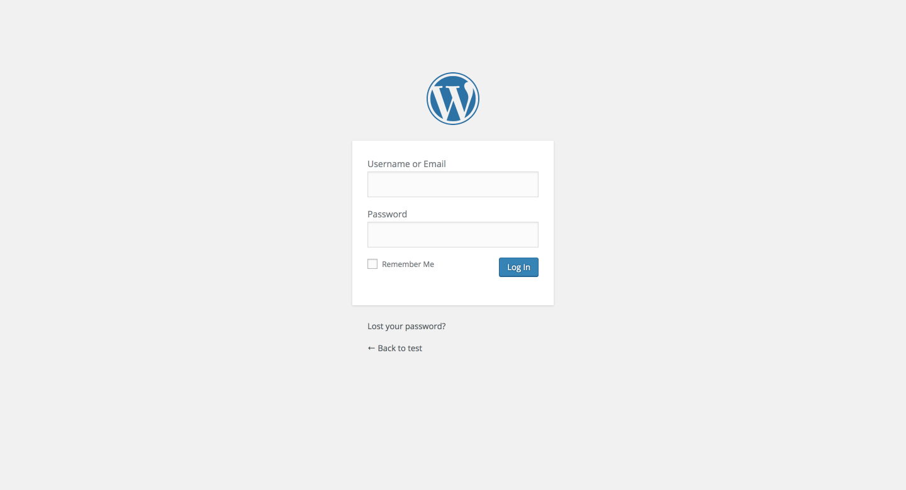

# How to use WordPress on DC/OS

[WordPress](https://wordpress.com/) is open source content management system based on PHP and MySQL that you can use to create a beautiful website, blog, or app.

- Estimated time for completion: 10 minutes
- Target audience:
    - Bloggers
    - Developers
- Scope: Learn how to deploy WordPress on DC/OS.


**Table of Contents**:

- [Prerequisites](#prerequisites)
- [Install MySQL using GUI](#install-mysql-using-gui)
- [Install MySQL using CLI](#install-mysql-using-cli)
- [Customize MySQL](#customize-mysql)
- [Install WordPress using GUI](#install-wordpress-using-gui)
- [Install WordPress using CLI](#install-wordpress-using-cli)
- [Access WordPress](#access-wordpress)
- [Use WordPress in production](#use-wordpress-in-production)


## Prerequisites

- DC/OS 1.11 or later
- [Marathon-LB](https://docs.mesosphere.com/services/marathon-lb/) must be installed and running
- Identify [IP of the public agent](https://docs.mesosphere.com/1.11/administering-clusters/locate-public-agent/) where Marathon-LB or an available hostname configured to point to the public agent(s) where Marathon-LB is running.
- DC/OS [CLI Setup](https://docs.mesosphere.com/1.11/cli/install)

## Install MySQL using GUI

- Login to DC/OS admin, click on Catalog on the left menu bar, search `mysql` and select the package.



- Go to Database tab and change config as below:
  - name: wordpress
  - username: wp_admin
  - password: password



- Go to Networking tab and enable(check) host mode



- Finally, click on `Review & Run` button.



- Wait for service to be up and running, go to Services section and check the service status.
- Now, go to [Customize MySQL](#customize-mysql) section.

## Install MySQL using CLI

Create a file called `mysql-config.json` and set the following properties:

```json
{
  "service": {
    "name": "mysql"
  },
  "database": {
    "name": "wordpress",
    "username": "wp_admin",
    "password": "password",
    "root_password": "wordpress"
  },
  "networking": {
    "port": 3306,
    "host_mode": true
  }
}
```

Then, install MySQL:

```bash
$ dcos package install mysql --options=mysql-config.json
By Deploying, you agree to the Terms and Conditions https://mesosphere.com/catalog-terms-conditions/#community-services
This DC/OS Service is currently in preview. There may be bugs, incomplete features, incorrect documentation, or other discrepancies.

```Advanced Installation options notes```

storage / *persistence*: create local persistent volumes for internal storage files to survive across restarts or failures.

storage / persistence / *external*: create external persistent volumes. This allows to use an external storage system such as Amazon EBS, OpenStack Cinder, EMC Isilon, EMC ScaleIO, EMC XtremIO, EMC VMAX and Google Compute Engine persistent storage. *NOTE*: To use external volumes with DC/OS, you MUST enable them during CLI or Advanced installation.

storage / *host_volume*:  if persistence is not selected, this package can use a local volume in the host for storage, like a local directory or an NFS mount. The parameter *host_volume* controls the path in the host in which these volumes will be created, which MUST be the same on all nodes of the cluster.

NOTE: If you didn't select persistence in the storage section, or provided a valid value for *host_volume* on installation,
YOUR DATA WILL NOT BE SAVED IN ANY WAY.

networking / *port*: This DC/OS service can be accessed from any other application through a NAMED VIP in the format *`service_name.marathon.l4lb.thisdcos.directory:port`*. Check status of the VIP in the *Network* tab of the DC/OS Dashboard (Enterprise DC/OS only).

networking / *external_access*: create an entry in Marathon-LB for accessing the service from outside of the cluster

networking / *external_access_port*: port to be used in Marathon-LB for accessing the service.
Continue installing? [yes/no] yes
Installing Marathon app for package [mysql] version [5.7.12-0.3]
Service installed.

Default login: `admin`/`password`. This username/password combination only applies if you haven't changed the defaults.
```

## Customize MySQL

- We need to customize our mysql service for further development. I will explain it later.
- Go to `mysql` service from services menu, click on `Edit` button.
- Chnage `Container Runtime` from `Docker Engine` to `Universal Container Runtime(UCR)`.
- Click on `Review & Run`.



## Install WordPress

To make WordPress accessible to the world, we need to use the fully qualified domain name of your DC/OS public agent. To install from the CLI, first create a `wordpress-config.json` file as below and replace the `virtual-host` property, i.e. `PUBLIC_AGENT_IP`, with your [public agent IP](https://docs.mesosphere.com/1.11/administering-clusters/locate-public-agent/) (for example `http://54.91.68.255`):

```json
{
  "database": {
    "host": "mysql.marathon.mesos:3306",
    "name": "wordpress",
    "user": "wp_admin",
    "password": "password"
  },
  "networking": {
    "virtual-host": "PUBLIC_AGENT"
  }
}
```

Now use above options file to install WordPress:

```bash
$ dcos package install wordpress --options=wordpress-config.json
By Deploying, you agree to the Terms and Conditions https://mesosphere.com/catalog-terms-conditions/#community-services
This DC/OS Service is currently in preview.
Continue installing? [yes/no] yes
Installing Marathon app for package [wordpress] version [1.0.0-4.5.3-apache]
WordPress has been installed.
```

Last but not least, to check if all required services (Marathon-LB, MySQL and WordPress itself) are running, use the DC/OS UI where in the `Services` tab you should see the following:



## Access WordPress

- Once you've installed the necessary services as outlined above, navigate to `PUBLIC_AGENT_IP/service/wordpress` in your browser or click on link right after wordpress service name. You should now see the WordPress setup wizard:



- Finish wordpress wizard process and go to terminal/cmd of your computer. I assume you already setup DC/OS CLI. run below command in terminal.

- Now, as we can see, everything is setup but there is no js, css support on our wordpress website because according to database, they are on different path. So we have to change our database url to load wordpress theme files like js, css, images.

- In order to change values in database, we have to go into mysql service container and change the values. DC/OS currently only support UCR(Uninversal Container Runtime), if we want to go inside the deployed container. It is the reason first we customized our mysql service right after we deployed it. Currently, there is no way that we can set our deployment service runtime to UCR. So we have to set it after we deployed it. Read more about this [here](https://docs.mesosphere.com/1.11/deploying-services/containerizers/).

```bash
$ dcos task exec --interactive --tty mysql bash
root@ip-10-0-2-74:/mnt/mesos/sandbox# mysql -u wp_admin -p
Enter password:
Welcome to the MySQL monitor.  Commands end with ; or \g.
Your MySQL connection id is 7
Server version: 5.7.12 MySQL Community Server (GPL)

Copyright (c) 2000, 2016, Oracle and/or its affiliates. All rights reserved.

Oracle is a registered trademark of Oracle Corporation and/or its
affiliates. Other names may be trademarks of their respective
owners.

Type 'help;' or '\h' for help. Type '\c' to clear the current input statement.

mysql> SHOW databases;
+--------------------+
| Database           |
+--------------------+
| information_schema |
| wordpress          |
+--------------------+
2 rows in set (0.00 sec)

mysql> USE wordpress;
Reading table information for completion of table and column names
You can turn off this feature to get a quicker startup with -A

Database changed
mysql> SELECT * FROM wp_options LIMIT 2;
+-----------+-------------+---------------------+----------+
| option_id | option_name |     option_value    | autoload |
+-----------+-------------+---------------------+----------+
|         1 | siteurl     | http://54.91.68.255 | yes      |
|         2 | home        | http://54.91.68.255 | yes      |
2 rows in set (0.00 sec)

mysql> UPDATE wp_options SET option_value="http://54.91.68.255/service/wordpress" WHERE option_id=1;
Query OK, 1 row affected (0.00 sec)
Rows matched: 1  Changed: 1  Warnings: 0

mysql> UPDATE wp_options SET option_value="http://54.91.68.255/service/wordpress" WHERE option_id=2;
Query OK, 1 row affected (0.00 sec)
Rows matched: 1  Changed: 1  Warnings: 0

mysql>exit
```

- Here, we are updating our wordpress server url so that it can serve js,css files and we will be able to see proper wordpress theme like below.

- Wordpress



- Wordpress Admin



## Use WordPress in production

By default, the WordPress package uses the `/tmp` directory on the node it runs on. If you plan to use this package for a production website, you will want to customize this to a well known directory, for example `/var/wordpress`, that you can backup easily. You will also want to specify the DC/OS host to pin the instance to, so if the package is ever upgraded or otherwise restarts, it is able to deploy to the same node.

An example `wordpress-config.json` might then look something like the following (again with `$PUBLIC_AGENT_IP` replaced by the FQDN of your public agent node):

```json
{
  "service": {
    "name": "wordpress-prod",
  },
  "networking": {
    "virtual-host": "$PUBLIC_AGENT_IP",
  },
  "storage": {
    "host-volume": "/var/wordpress",
  }
}
```

