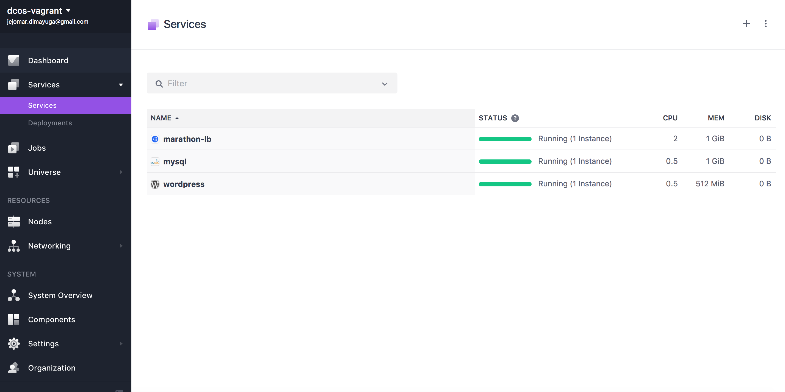
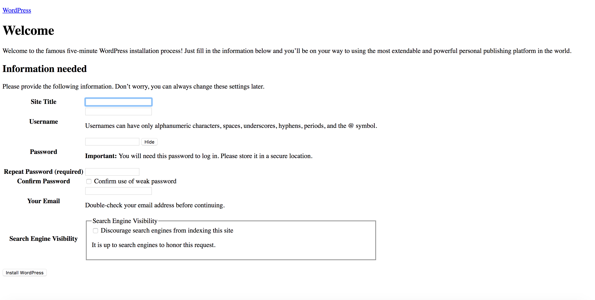

# How to use WordPress on DC/OS

[WordPress](https://wordpress.com/) is a popular blogging platform.

- Estimated time for completion: 10 minutes
- Target audience: Anyone interested using a blog.
- Scope: Learn how to use WordPress on DC/OS.


**Table of Contents**:

- [Prerequisites](#prerequisites)
- [Install Marathon-LB](#install-marathon-lb)
- [Install MySQL](#install-mysql)
- [Install WordPress](#install-wordpress)
- [Access WordPress](#access-wordpress)
- [Use WordPress in production](#use-wordpress-in-production)

## Prerequisites

- A running DC/OS 1.9 cluster with at least 1 [public agent](https://dcos.io/docs/1.9/overview/concepts/#public-agent-node) node with 2 CPUs and 1 GB of RAM available.
- [DC/OS CLI](https://dcos.io/docs/1.9/usage/cli/install/) installed.

## Install Marathon-LB

To make WordPress accessible from the public Internet, we will use [Marathon-LB](https://github.com/mesosphere/marathon-lb), a HA-proxy-based load balancer for DC/OS. To install Marathon-LB from the DC/OS CLI, do:

```bash
$ dcos package install marathon-lb
We recommend at least 2 CPUs and 1GiB of RAM for each Marathon-LB instance. 

*NOTE*: ```Enterprise Edition``` DC/OS requires setting up the Service Account in all security modes. 
Follow these instructions to setup a Service Account: https://docs.mesosphere.com/administration/id-and-access-mgt/service-auth/mlb-auth/
Continue installing? [yes/no] yes
Installing Marathon app for package [marathon-lb] version [1.7.0-1]
Marathon-lb DC/OS Service has been successfully installed!
See https://github.com/mesosphere/marathon-lb for documentation.
```
Note that for advanced Marathon-LB configurations such as enabling HTTPS see the [Marathon-LB Quick Start](https://dcos.io/docs/1.9/usage/service-discovery/marathon-lb/quickstart/) guide.

## Install MySQL

Next, we install and set up MySQL via the DC/OS CLI. For this, create a file called `config.json` and set the following properties:

```json
{
  "service": {
    "name": "mysql"
  },
  "database": {
    "name": "wordpress",
    "username": "wordpress",
    "password": "password",
    "root_password": "wordpress"
  },
  "networking": {
    "port": 3306,
    "host_mode": true
  }
}
```

Then, install MySQL:

```bash
$ dcos package install mysql --options=config.json 
This DC/OS Service is currently in preview. There may be bugs, incomplete features, incorrect documentation, or other discrepancies.

```Advanced Installation options notes```

storage / *persistence*: create local persistent volumes for internal storage files to survive across restarts or failures.

storage / persistence / *external*: create external persistent volumes. This allows to use an external storage system such as Amazon EBS, OpenStack Cinder, EMC Isilon, EMC ScaleIO, EMC XtremIO, EMC VMAX and Google Compute Engine persistent storage. *NOTE*: To use external volumes with DC/OS, you MUST enable them during CLI or Advanced installation.

storage / *host_volume*:  if persistence is not selected, this package can use a local volume in the host for storage, like a local directory or an NFS mount. The parameter *host_volume* controls the path in the host in which these volumes will be created, which MUST be the same on all nodes of the cluster.

NOTE: If you didn't select persistence in the storage section, or provided a valid value for *host_volume* on installation,
YOUR DATA WILL NOT BE SAVED IN ANY WAY.

networking / *port*: This DC/OS service can be accessed from any other application through a NAMED VIP in the format *`service_name.marathon.l4lb.thisdcos.directory:port`*. Check status of the VIP in the *Network* tab of the DC/OS Dashboard (Enterprise DC/OS only).

networking / *external_access*: create an entry in Marathon-LB for accessing the service from outside of the cluster

networking / *external_access_port*: port to be used in Marathon-LB for accessing the service.
Continue installing? [yes/no] yes
Installing Marathon app for package [mysql] version [5.7.12-0.3]
Service installed.

Default login: `admin`/`password`. This username/password combination only applies if you haven't changed the defaults.
```

## Install WordPress

To make WordPress accessible to the world, we need to use the fully qualified domain name of your DC/OS public agent. To install from the CLI, first create a `config.json` as below and replace the `virtual-host` property, i.e. `$PUBLIC_AGENT`, with your own (for example `http://ec2-52-51-80-141.eu-west-1.compute.amazonaws.com`):

```json
{
  "database": {
    "host": "mysql.marathon.mesos:3306",
    "name": "wordpress",
    "user": "wordpress",
    "password": "password"
  },
  "networking": {
    "virtual-host": "$PUBLIC_AGENT"
  }
}
```

Now use above options file to install WordPress:

```bash
$ dcos package install wordpress --options=config.json 
This DC/OS Service is currently in preview.
Continue installing? [yes/no] yes
Installing Marathon app for package [wordpress] version [1.0.0-4.5.3-apache]
WordPress has been installed.
```

Last but not least, to check if all required services (Marathon-LB, MySQL and WordPress itself) are running, use the DC/OS UI where in the `Services` tab you should see the following:



## Access WordPress

Once you've installed the necessary services as outlined above, navigate to the domain name of your DC/OS public agent in your browser. You should now see the WordPress welcome wizard:



## Use WordPress in production

By default, the WordPress package uses the `/tmp` directory on the node it runs on. If you plan to use this package for a production website, you will want to customize this to a well known directory, for example `/var/wordpress`, that you can backup easily. You will also want to specify the DC/OS host to pin the instance to, so if the package is ever upgraded or otherwise restarts, it is able to deploy to the same node.

An example `config.json` might then look something like the following (again with `$PUBLIC_AGENT` replaced by the FQDN of your public agent node):

```json
{
  "service": {
    "name": "wordpress-prod",
  },
  "networking": {
    "virtual-host": "$PUBLIC_AGENT",
  },
  "storage": {
    "host-volume": "/var/wordpress",
    "pinned-hostname": "10.0.1.1"
  }
}
```
