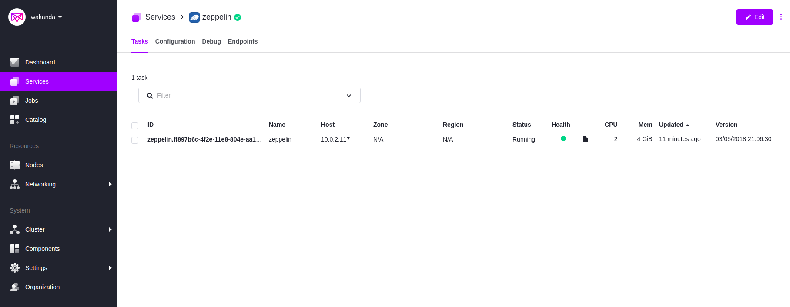
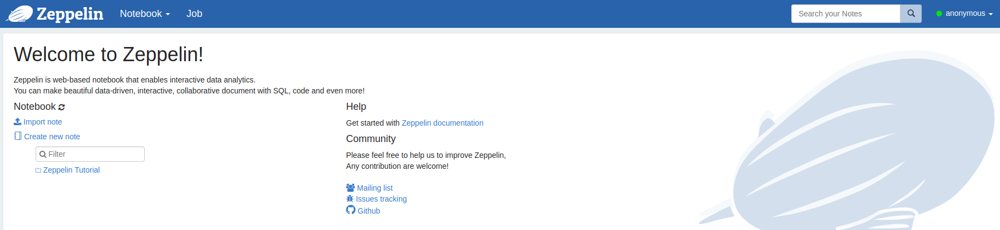
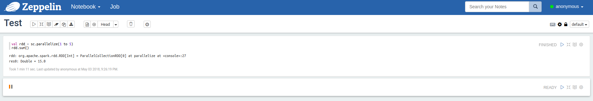
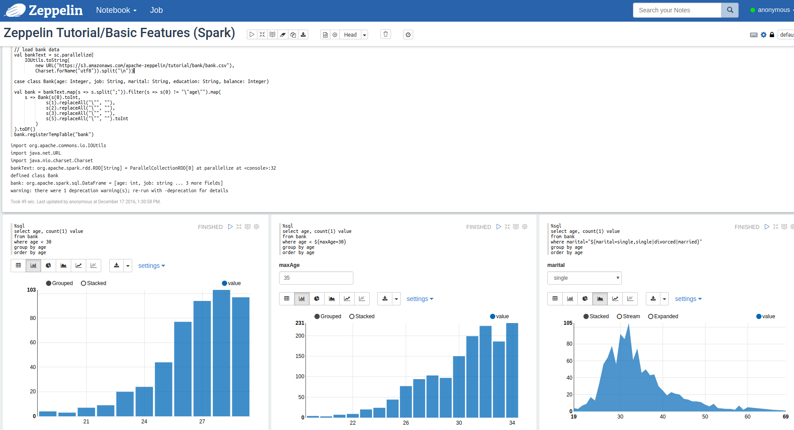

# How to use Apache Zeppelin on DC/OS

[Apache Zeppelin](https://zeppelin.apache.org/) is a web-based notebook that enables you to do interactive data analytics. For example, you can use it as a front-end for [Apache Spark](https://github.com/dcos/examples/tree/master/spark/1.11).

- Estimated time for completion: 10 minutes
- Target audience: Data scientists and data engineers that want an interactive data analytics tool.
- Scope: Install, configure and use Zeppelin in DC/OS.

**Table of Contents**:

- [Prerequisites](#prerequisites)
- [Install Zeppelin](#install-zeppelin)
- [Configure Zeppelin](#configure-zeppelin)
- [Use Zeppelin](#use-zeppelin)
- [Uninstall Zeppelin](#uninstall-zeppelin)

## Prerequisites

- A running DC/OS 1.11 cluster with 2 agents (one private, one public) with 4 cores and 8 GB of RAM available on the private agent.
- [DC/OS CLI](https://docs.mesosphere.com/1.11/cli/install/) installed.
- [Marathon-LB](https://docs.mesosphere.com/services/marathon-lb/) installed.
- [Enterprise CLI](https://docs.mesosphere.com/1.11/cli/enterprise-cli/) installed (optionally, if you want to use secrets).
- [External volumes](https://docs.mesosphere.com/1.11/storage/external-storage/) configured (optionally, if you want to use external storage for notebooks)
- [HDFS](https://docs.mesosphere.com/services/hdfs/2.2.0-2.6.0-cdh5.11.0/) installed (optionally, if you want to access HDFS from spark)

## Install Zeppelin

You typically want to access Zeppelin via a web browser outside of the DC/OS cluster. To access the Zeppelin UI from outside of the DC/OS cluster you can use Marathon-LB, which is recommended for production usage (see [Configure Zeppelin](#configure-zeppelin) for that). The following steps will install zeppelin:

```bash
$ dcos package install zeppelin
This DC/OS Service is currently in preview.
Continue installing? [yes/no] yes
Installing Marathon app for package [zeppelin] version [1.0-0.8.0-2.2.1]
DC/OS Zeppelin is being installed!

	Documentation:  https://github.com/dcos/examples/tree/master/zeppelin/1.11
	Issues: https://dcos.io/community or
		 	https://github.com/MaibornWolff/dcos-zeppelin
```

After this, you should see the Zeppelin service running via the `Services` tab of the DC/OS UI:



## Configure Zeppelin
Zeppelin can be adapted for your needs by providing a config.json at installation.
The following features can be configured:
* Marathon-LB vhost
* persistent volume (local or external) for notebook data
* Authentication/Authorization config
* Extra python and r packages
* Spark resources
* Hdfs access for spark

Create an `options.json` that looks like this:

```json
{
  "service": {
    "name": "zeppelin",
    "cores": 2,
    "memory": 4096,
		"external_persistent_volume": "volume-zeppelin-data",
		"marathon_lb": true,
		"marathon_lb_vhost": "zeppelin.mydomain.com"
  },
	"zeppelin": {
		"shiro_conf_secret": "zeppelin/shiroconf",
		"python_packages": "tensorflow requests",
		"r_packages": "c('glmnet', 'caret')"
	},
	"spark": {
		"cores_max": 2,
		"executor_memory": "1g",
		"use_hdfs": true
	}
}
```

For more options check the config schema via `dcos package describe zeppelin --config`.

And create a `shiro.ini` that looks like this:
```
[users]
# List of users with their password allowed to access Zeppelin.
admin = changeme, admin
janedoe = supersecret, analyst

[main]
sessionManager = org.apache.shiro.web.session.mgt.DefaultWebSessionManager
securityManager.sessionManager = $sessionManager
# 86,400,000 milliseconds = 24 hour
securityManager.sessionManager.globalSessionTimeout = 86400000
shiro.loginUrl = /api/login

[roles]
analyst = *
admin = *

[urls]
/api/version = anon
/api/interpreter/** = authc, roles[admin]
/api/configurations/** = authc, roles[admin]
/api/credential/** = authc, roles[admin]
/** = authc
```

Deploy the package via:

```bash
$ dcos security secrets create -f shiro.ini /zeppelin/shiroconf
$ dcos package install zeppelin --options=options.json --yes
```

Additional options:
* Change `shiro_conf_secret` to `shiro_conf_url` and provide a http URL to the shiro.ini file (for example via some fileserver like [nginx](https://github.com/dcos/examples/tree/master/nginx/1.11)).
* Change `external_persistent_volume` to `local_persistent_volume` and zeppelin will use a local persistent volume (Attention: if the node zeppelin runs on dies the data is lost).
* If you have a non-standard hdfs installation you can provide its endpoints path via `spark.hdfs_config_url`.
* Provide extra java and spark options for the Spark Interpreter using `spark.java_opts` (for example `-Dspark.mesos.uris=http://my.domain/mydata.csv`).

## Use Zeppelin

In the DC/OS UI, clicking on the `Open Service` button in the right upper corner leads to the Zeppelin UI:



Alternatively use the domain you configured in the `config.json` file (in this example `zeppelin.mydomain.com`).

To get started with Zeppelin you can create a new Notebook and paste the following Spark snippet in Scala:

```
val rdd = sc.parallelize(1 to 5)
rdd.sum()
```
After you've pressed the `Run all paragraphs` button (the triangle/play button in the menu), you should see something like the following



Next, you can check out the built-in tutorial in form of a Notebook called [Zeppelin Tutorial](http://zeppelin.apache.org/docs/0.8.0/quickstart/tutorial.html):



To use the python interpreter with TensorFlow create a new Notebook and paste the following snippet and run it:
```
%pyspark
import tensorflow as tf
hello = tf.constant('Hello, TensorFlow!')
sess = tf.Session()
print(sess.run(hello))
```

For python and R you can find examples in the built-in tutorial notebooks.

## Uninstall Zeppelin

To uninstall Zeppelin:

```bash
$ dcos package uninstall zeppelin
```

## Further resources

1. [Zeppelin docs](http://zeppelin.apache.org/docs/0.8.0/)
