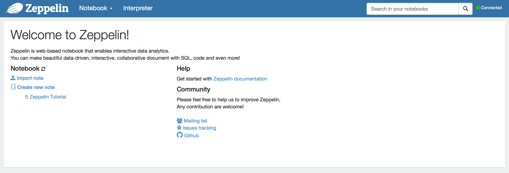
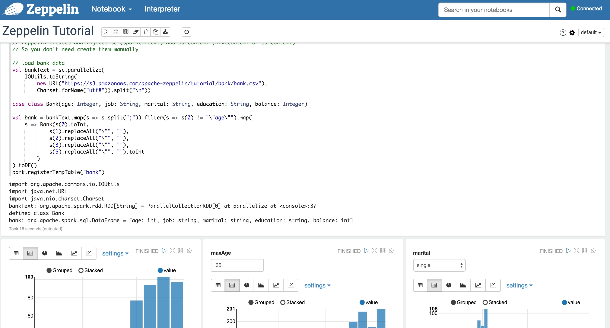

# How to use Apache Zeppelin on DC/OS

[Apache Zeppelin](https://zeppelin.apache.org/) is a web-based notebook that enables you to do interactive data analytics. For example, you can use it as a front-end for [Apache Spark](https://github.com/dcos/examples/tree/master/1.8/spark).

- Estimated time for completion: 8 minutes
- Target audience: Data scientists and data engineers that want an interactive data analytics tool.
- Scope: Install and use Zeppelin in DC/OS.

**Table of Contents**:

- [Prerequisites](#prerequisites)
- [Install Zeppelin](#install-zeppelin)
- [Use Zeppelin](#use-zeppelin)
- [Uninstall Zeppelin](#uninstall-zeppelin)

## Prerequisites

- A running DC/OS 1.8 cluster with 2 agents (one private, one public) each with 2 CPUs and 2 GB of RAM available.
- [DC/OS CLI](https://dcos.io/docs/1.8/usage/cli/install/) installed.

## Install Zeppelin

You typically want to access Zeppelin via a web browser outside of the DC/OS cluster. To access the Zeppelin UI from outside of the DC/OS cluster you can use [Marathon-LB](https://dcos.io/docs/1.8/usage/service-discovery/marathon-lb/), which is recommended for production usage.

In the following we will use the DC/OS [Admin Router](https://dcos.io/docs/1.8/development/dcos-integration/#-a-name-adminrouter-a-admin-router) to provide access to the Zeppelin UI, which is fine for dev/test setups:

```bash
$ dcos package install zeppelin
Installing Marathon app for package [zeppelin] version [0.5.6]
DC/OS Zeppelin is being installed!

	Documentation: https://docs.mesosphere.com/zeppelin/
	Issues: https://docs.mesosphere.com/support/
```

After this, you should see the Zeppelin service running via the `Services` tab of the DC/OS UI:


## Use Zeppelin

In the DC/OS UI, clicking on the `Open Service` button in the right upper corner leads to the Zeppelin UI:



To get started with Zeppelin you can create a new Notebook and paste the following Spark snippet in Scala:

```
val rdd = sc.parallelize(1 to 5)
rdd.sum()
```
After you've pressed the `Run all paragraphs` button (the triangle/play button in the menu), you should see something like the following


Next, you can check out the built-in tutorial in form of a Notebook called [Zeppelin Tutorial](http://zeppelin.apache.org/docs/0.5.6-incubating/tutorial/tutorial.html):



## Uninstall Zeppelin

To uninstall Zeppelin:

```bash
$ dcos package uninstall zeppelin
```

## Further resources

1. [Zeppelin docs](http://zeppelin.apache.org/docs/0.5.6-incubating/)


